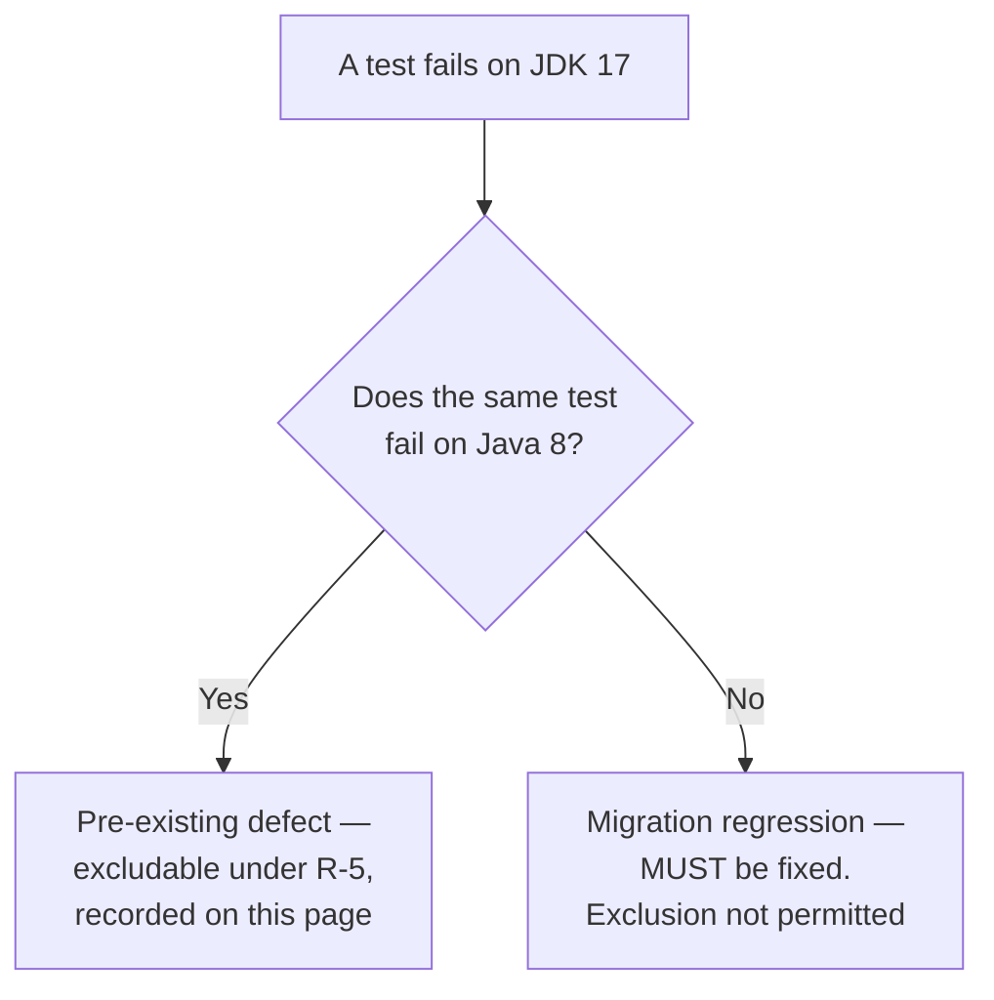

# Baseline Test Failures

This page records the unit-test failures that were already present at the Java 8 base commit, before any part of the Java 17 migration was applied. It is the sole justification for the only two test exclusions the migration introduces, and it is the record the project's setup instructions point at when they state that four unit-test failures are expected.

## Why this record exists

Rule **R-5** limits test exclusions to failures present at baseline. That makes a *measured* baseline a precondition rather than a formality: a baseline that is asserted rather than measured cannot support a single exclusion, because there is nothing to audit the exclusion list against. This page exists to be that audit surface — a reader should be able to check every exclusion the migration introduces using this page alone.

A note on where the rules come from, because it is not obvious from the repository. `review_rules` returns **no user rules provided**; there is no on-disk rules document for this project. The seven binding rules are delivered instead through the user prompt's own RULES block, and their full verbatim text is available from the `review_prompt` tool. This document cites them by the stable identifiers **R-1** through **R-7** and deliberately does not reproduce their text — `review_prompt` is the source of record for that.

Three of the seven govern this page directly:

| Rule | Scope | What it requires of this page |
| --- | --- | --- |
| **R-5** | Test configuration | Prove the baseline was measured, enumerate what it found, show the exclusion list covers **only** those failures, show that failures which pass on Java 8 were fixed rather than excluded, and disclose the collateral cost honestly. |
| **R-7** | All behavioural decisions | Present the Java 8 capture as the mechanism that settles ambiguity, and record the specific observation that settled each call. |
| **R-6** | All source | Document the four failures as pre-existing defects **without fixing them** — no test source is edited and no assertion is changed. |

The project's setup instructions cite this document as the record of the expected failures. At the base commit it **did not exist**, and neither did the `docs/migration/` directory, which is why it is a creation rather than an update and why the count it is cited for is established here for the first time.

## How the baseline was measured

The base commit is `c8f6226105`, the parent of the first migration commit. Its root POM still declares `<java.version>1.8</java.version>`, expanded into `source`, `target` and `compilerVersion` in two separate plugin blocks, so it is a genuine Java 8 tree rather than a Java 17 tree pinned backwards.

- A pristine copy of the base commit was extracted with `git archive`, **without touching the working tree or the git metadata**. Nothing was checked out, stashed or reset to obtain it.
- The four test sources this page reports on were verified **byte-identical** to the current tree by checksum, so nothing in the comparison depends on the test code having stayed still — it is demonstrated.
- The baseline was built and run on **JDK 1.8.0_502**. The comparison runtime for the migrated tree is **JDK 17.0.20**, with **Maven 3.8.7** on both sides. An earlier capture taken while the migration was being designed used JDK 1.8.0_492 and JDK 17.0.19; it found the same four failures, so the result does not depend on the patch level of either JDK, and both figures may be encountered in this documentation set.
- The baseline was built against an **isolated Maven repository with the ArkCase artifacts removed**.

That last point is the detail that makes the measurement trustworthy, and it is not a precaution against a hypothetical problem. Building the base commit against the shared local repository **fails outright**, because the repository already holds ArkCase artifacts compiled by the migrated build:

```text
bad class file: /root/.m2/repository/com/armedia/acm/acm-core-api/2021.03/acm-core-api-2021.03.jar
  (com/armedia/acm/core/exceptions/AcmObjectNotFoundException.class)
  class file has wrong version 61.0, should be 52.0
```

Class-file major version 61 is Java 17 and 52 is Java 8. A migrated sibling module had leaked into the resolution of a Java 8 compile. Had the baseline been measured that way, the numbers would have described a hybrid of the two trees rather than the base commit. With the ArkCase coordinates removed from the local repository and the dependency chain rebuilt from source on JDK 8, the base tree reports `BUILD SUCCESS` and the measurement below is genuinely of the base commit.

One further starting condition matters, because it determines how visible any exclusion is. At the base commit:

- **No `maven-surefire-plugin` declaration exists in any of the 145 POMs.** The reactor silently inherits Maven 3.8.7's default, 2.12.4.
- **No surefire or failsafe `<excludes>` and no `<testFailureIgnore>` exists anywhere in the repository.** Both were confirmed by enumerating all 145 POMs; the single `<excludes>` element the base POM does contain belongs to the JaCoCo plugin, not to a test runner.

So the migration starts from a clean slate. Every exclusion it introduces appears in a single-file diff of the root POM, is attributable to this document, and cannot hide behind a pre-existing suppression.

## The four measured failures

| Module | Test class | Java 8 baseline result |
| --- | --- | --- |
| `acm-services/acm-service-ecm` | `FileDownloadAPIControllerTest` | 4 run, **3 failures** |
| `acm-services/acm-service-compress-folder` | `FolderCompressorTest` | 3 run, **1 error** |
| `acm-tool-integrations/acm-transcribe-tool` | `AWSTranscribeServiceTest` | 6 run, **all pass** |
| `acm-tool-integrations/acm-comprehend-medical` | `AWSComprehendMedicalServiceTest` | 8 run, **all pass** |

The total is **exactly four baseline failures** — three failures and one error — which corroborates the project setup instruction that four unit-test failures are expected. The two passing rows are not filler: they are the evidence that makes the next section's conclusion possible, and removing them would leave that conclusion unsupported.

Characterised precisely:

- The **three controller failures are all the same mock-verification assertion**, raised from the test's own verify-all call rather than from three different causes. All three surface as `java.lang.AssertionError` thrown at `org.easymock.EasyMockSupport.verifyAll`, reached from `downloadFileByIdAndVersion_successful`, `downloadFileById_successful` and `override_mime_type`. The unmet expectations are a content-stream filename read and a published application event that the controller never performs.
- The **compressor error is a `NullPointerException` arising from a stream that is closed and then finished again**. It reports `Deflater has been closed` from `testCompressFolderMaxSize`, along the chain `DeflaterOutputStream.close` to `ZipOutputStream.finish` to `closeEntry` to `deflate` to `ensureOpen`: the deflater is already closed when the close path asks it to compress once more.

### The observation that settles R-7

Both outcomes are **identical on JDK 8 and JDK 17**, differing only in library-internal line numbers.

For the controller, the failure is raised at `EasyMockSupport.verifyAll` line 523 on **both** JVMs, entered from test lines 264, 182 and 344 on both. For the compressor, the exception type, the message and the entire call chain match; only the line numbers inside `java.util.zip` move, and JDK 17 additionally prefixes those frames with its `java.base/` module name:

| Frame | JDK 8 | JDK 17 |
| --- | --- | --- |
| `Deflater.ensureOpen` | 559 | 898 |
| `ZipOutputStream.finish` | 368 | 374 |
| `DeflaterOutputStream.close` | 268 | 267 |

This licenses an inference worth stating explicitly, because it removes a plausible suspicion about the migration. The controller failure is an EasyMock verification failure, and the migration moves `easymock.version` from **4.1 to 4.3**. If that upgrade had altered the outcome, these would be migration-attributable failures rather than baseline ones. The verification fails at the same frame, at the same line, from the same three test methods, under both the old and the new EasyMock — so the upgrade **did not** alter either outcome, and both remain pre-existing defects.

Under **R-6** they are documented and deliberately not fixed. The compressor's double-close and the controller's mock expectations are left exactly as the base commit wrote them; see [the known-issues register](known-issues.md) for the defects the migration documents rather than repairs.

The verified source paths, for a reader who wants to look:

- `acm-services/acm-service-ecm/src/test/java/com/armedia/acm/plugins/ecm/web/api/FileDownloadAPIControllerTest.java`
- `acm-services/acm-service-compress-folder/src/test/java/com/armedia/acm/compressfolder/FolderCompressorTest.java`
- `acm-tool-integrations/acm-transcribe-tool/src/test/java/com/armedia/acm/tool/transcribe/AWSTranscribeServiceTest.java`
- `acm-tool-integrations/acm-comprehend-medical/src/test/java/com/armedia/acm/tool/comprehendmedical/AWSComprehendMedicalServiceTest.java`

## The two tests that were fixed, not excluded

`AWSTranscribeServiceTest` and `AWSComprehendMedicalServiceTest` both failed on JDK 17 when the migration was first applied. Both **pass on Java 8** — 6 run and 8 run respectively, with no failures and no errors. They were therefore **migration regressions, not baseline failures**, and **R-5** did not permit excluding them.

They were fixed by adding the module-access directives their own stack traces named, and both then went **fully green** on JDK 17: 6 tests and 8 tests, zero failures, zero errors, zero skipped. The per-directive attribution — which option, which pinned library demanded it, and the exact frame that failed without it — is in [the add-opens exceptions record](add-opens-exceptions.md). Every one of those directives is confined to the forked test JVM; none is added to the production launch configuration.

The general principle this establishes, and the test any future exclusion must pass:



A JDK 17 failure is only excludable if the same test fails on Java 8. Everything else has to be fixed, which is why these two were.

## The exclusion mechanism, and the two alternatives rejected on evidence

**Adopted.** Exactly two class-level entries in the new `maven-surefire-plugin` `<excludes>` block in the root `pom.xml`:

```xml
<excludes>
    <exclude>**/FileDownloadAPIControllerTest.java</exclude>
    <exclude>**/FolderCompressorTest.java</exclude>
</excludes>
```

Nothing else. No added `@Ignore` annotation, no `<testFailureIgnore>`, no negation filter, and **no modified assertion anywhere in the 402 test sources** the base commit contains. That last claim is demonstrated rather than asserted: comparing the base commit with the migrated tree shows **no pre-existing test source modified at all**. The migration adds five new test classes to cover its own source changes, which is an addition, not an edit to an existing assertion.

**Rejected — method-level filters.** The narrower exclusion is not merely inconvenient, it is impossible. Surefire refuses a method-level filter outright and fails the build:

```text
Method filter prohibited in includes|excludes parameter:
**/FolderCompressorTest.java#testCompressFolderMaxSize
```

This is the whole reason the granularity is class-level. It is forced by the tool, not chosen for convenience, and it is what creates the collateral cost disclosed in the next section.

**Rejected — a negation-only test filter.** Passing `-Dtest='!FileDownloadAPIControllerTest'` does run, so it looks like a viable narrower option. It is not: it silently rewrites test discovery. `acm-services/acm-service-ecm` holds 107 tests, of which the adopted exclusion leaves 103 green. Under the negation filter the same module instead reports **123 tests with twelve errors** — it picks up classes the configured include pattern never selects, and those **twelve new errors** do not exist under the adopted approach. A mechanism that changes *what runs* elsewhere in the reactor is disqualified regardless of whether it happens to pass, because it destroys the very property this page is meant to guarantee — that the only tests not running are the ones named here.

**Verified outcome of the adopted approach.** The two owning modules stay green, at **103** tests in `acm-service-ecm` and **4** tests in `acm-service-compress-folder`, both with zero failures, zero errors and zero skips.

## The honest collateral cost

**Seven tests are skipped, not four.** The four baseline failures, plus **three passing sibling tests** in the same two classes, because surefire cannot express an exclusion narrower than a whole class. `FileDownloadAPIControllerTest` holds 4 tests of which 3 fail, and `FolderCompressorTest` holds 3 of which 1 errors; excluding both classes therefore removes 7 tests to suppress 4 failures.

This is not free and it is not buried in a footnote. Three tests that pass on both JVMs no longer run, and that is a real reduction in coverage accepted knowingly because the alternatives above are either rejected by the tool or change test discovery elsewhere. If surefire ever supports method-level exclusion, the correct follow-up is to narrow these two entries to the four failing methods and restore the three siblings.

A second, separate cost must be disclosed alongside it, because it is easy to mistake for something this migration caused. The configured run reports **21 skipped tests**, and none of them are the seven above — the excluded classes do not run at all, so they are not counted as skipped. All 21 are pre-existing `@Ignore` annotations in unchanged baseline test sources:

| Test class | Skipped |
| --- | --- |
| `CaseFileEnterQueueBusinessRuleTest` | 13 |
| `CloseComplaintServiceTest` | 1 |
| `ActivitiTaskDaoTest` | 1 |
| `CalendarEntityHandlerTest` | 1 |
| `OutlookFolderCreatorPasswordMd5ToSha256UpdateExecutorTest` | 1 |
| `AcmFilesystemMailTemplateConfigurationServiceTest` | 1 |
| `ResponseFolderCompressorServiceTest` | 1 |
| `AcmCryptoUtilsImplTest` | 1 |
| `ZylabProductionFileExtractorTest` | 1 |

> A zero-skip run is therefore **not reachable** from this configuration, and reporting one would be inaccurate. Reaching it would require deleting `@Ignore` annotations from baseline test sources, which **R-5** and the preserve-assertions mandate both forbid. Do not add a third exclusion, a negation filter or a failure-ignore flag to move these numbers.

## Test-count reconciliation

The arithmetic is given explicitly, because a published figure was wrong once and the correction belongs on the record rather than in a commit message.

| Configuration | Tests | Failures | Errors | Skipped | Report files | Classes |
| --- | --- | --- | --- | --- | --- | --- |
| No exclusions, failure-ignore enabled | 925 | 3 | 1 | 21 | 284 | 283 |
| Final configured run | **918** | **0** | **0** | 21 | 282 | 281 |

The difference is **exactly seven**: 925 − 918 = 7, and 4 baseline failures + 3 incidentally-skipped passing siblings = 7. Both readings of the number agree, which is the check that the exclusion is doing precisely what this page claims and nothing more. The final run covers **142** reactor modules and exits 0.

Three further readings from the same pair of runs corroborate it independently, and each would break if the exclusion were reaching further than stated:

- The report-file and class counts drop by **exactly two** — 284 to 282 and 283 to 281 — which is the two excluded classes and no third one. (Classes trail report files by one in both runs because `CaseFileNextPossibleQueuesBusinessRuleTest` exists in two modules, so aggregating by class name coalesces the pair.)
- The skipped count is **21 in both runs**, unchanged by the exclusion. This is the proof that the seven excluded tests and the 21 `@Ignore` skips are disjoint populations, and that the exclusion neither creates nor conceals a skip.
- With the exclusions removed, the **only** two classes reporting any failure or error across the entire 925-test suite on JDK 17 are `FileDownloadAPIControllerTest` (4 run, 3 failures) and `FolderCompressorTest` (3 run, 1 error). Nothing else in the reactor fails. That is the strongest form of the **R-5** claim available: the exclusion list is not merely *limited to* baseline failures, it is *exactly* the set of classes that still fail, so no migration regression is hiding behind it.

Two earlier figures are formally withdrawn:

- **893 is withdrawn.** It was a grep artifact — a count of matching text in build output rather than a total reported by the test runner — and it never described an executed suite. Static counting is exactly the error this page avoids: every number above is read from surefire's own XML reports and cross-checked against Maven's per-module summary lines, which agree exactly.
- **The interim pair 780 and 773 is superseded** by the measured 925 and 918. Those two were captured earlier in the migration, before the change set added five new test classes to cover its own source edits, and they also predate the recognition that 21 pre-existing `@Ignore` skips make a zero-skip total unreachable. The invariant they were cited for is unchanged and is the part that matters: the gap between the unexcluded and configured runs is still exactly seven, still decomposing as 4 + 3. Only the absolute totals moved, and they moved because tests were **added**, never because any test was disabled.

## What this record does not cover

**Integration tests.** This page is about the surefire surface only. `maven-failsafe-plugin` is aligned to the same `${surefire.version}` pin — **3.5.3** — replacing a hardcoded 2.17, and its `forkCount`, `reuseForks` and `threadCount` settings are preserved verbatim from the base commit. Six test files reference PowerMock, and one of them, `CategoryServiceIT`, is an integration test, so it is run by failsafe rather than surefire and none of the exclusions on this page apply to it.

**Everything outside the test surface.** For the pre-existing defects as a register, including the two documented on this page and the several the migration found elsewhere, see [the known-issues register](known-issues.md). For ambiguities resolved against observed Java 8 base-commit behaviour outside the test surface — the R-7 decisions this page does not own — see [the behavioral decisions record](behavioral-decisions.md).
