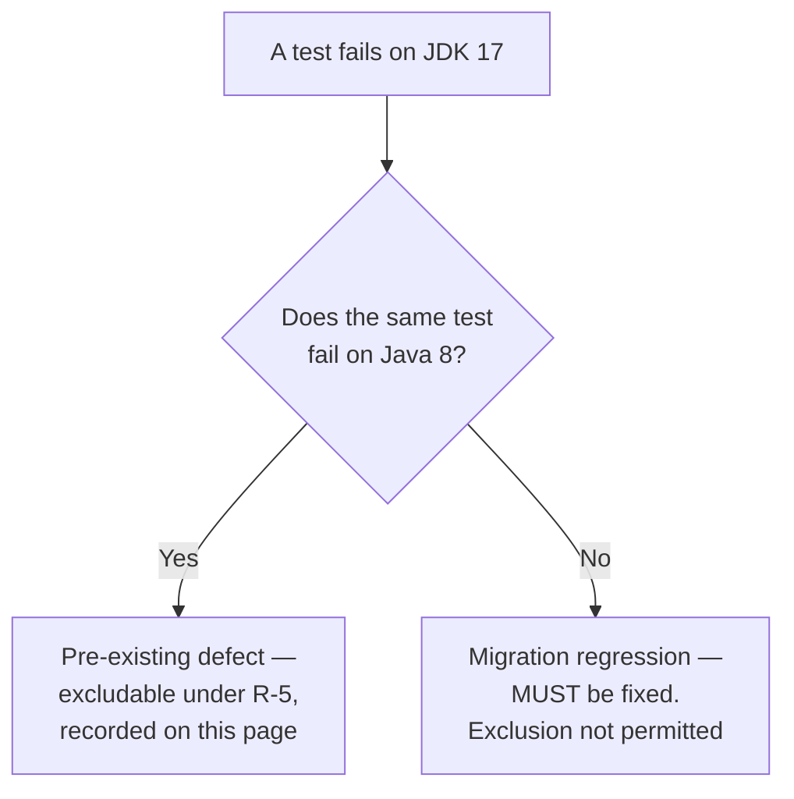

# Baseline Test Failures

This page records the unit-test failures that were already present at the Java 8 base commit, before any part of the Java 17 migration was applied. It is the sole justification for the only two test exclusions the migration introduces, and it is the record the project's setup instructions point at when they state that four unit-test failures are expected.

## Why this record exists

The migration works under a constraint that test exclusions may cover only failures already present at baseline — **R-5** in the numbering [the behavioural-decisions record](behavioral-decisions.md#the-constraints-this-migration-works-under) uses, where all seven constraints are summarised once. That makes a *measured* baseline a precondition rather than a formality: a baseline that is asserted rather than measured cannot support a single exclusion, because there is nothing to audit the exclusion list against. This page exists to be that audit surface — a reader should be able to check every exclusion the migration introduces using this page alone, by re-running the commands it publishes.

Three constraints bear on it directly: exclusions are limited to baseline failures (R-5); observed Java 8 base-commit behaviour settles any ambiguity (R-7); and pre-existing defects are documented rather than fixed (R-6), so no test source is edited and no assertion is changed anywhere in this migration.

## How the baseline was measured

The base commit is `c8f6226105`, the parent of the first migration commit. Its root POM still declares `<java.version>1.8</java.version>`, expanded into `source`, `target` and `compilerVersion` in two separate plugin blocks, so it is a genuine Java 8 tree rather than a Java 17 tree pinned backwards.

The whole procedure is four commands, and it is the procedure a reader should repeat rather than take on trust:

```bash
# 0. materialise the copy OUTSIDE the checkout, so the working tree gains no untracked directory
BASE_DIR="$(mktemp -d /tmp/arkcase-base-commit.XXXXXX)"
# 1. a pristine copy of the base commit, without touching the working tree or the git metadata
git archive c8f6226105 | tar -x -C "$BASE_DIR"
# 2. prove it is the base commit
git show c8f6226105:pom.xml | md5sum && md5sum "$BASE_DIR/pom.xml"
# 3. run the whole unit suite on Java 8, letting every module report rather than stopping at the first failure
(cd "$BASE_DIR" && JAVA_HOME=/path/to/jdk8 mvn -B -T 2 -fae -Dmaven.test.failure.ignore=true test)
# 4. count from the runner's own XML, not from the console log
find "$BASE_DIR" -name 'TEST-*.xml' -path '*/surefire-reports/*' | wc -l
# 5. remove it when finished; nothing inside the checkout was written
rm -rf "$BASE_DIR"
```

- Step 0 is not incidental. `git archive` writes wherever it is told, and `blitzy/` aside this repository ignores almost nothing, so extracting into the current directory would leave a whole second copy of the tree untracked and stageable. `mktemp -d` under `/tmp` puts it demonstrably outside the checkout, and step 5 removes it.
- The extraction is read-only with respect to the repository: nothing is checked out, stashed or reset to obtain it, and the md5 comparison in step 2 demonstrates rather than assumes that the tree is the base commit.
- The four test sources this page reports on were verified **byte-identical** to the current tree by checksum, so nothing in the comparison depends on the test code having stayed still.
- The baseline was built and run on **JDK 1.8.0_502**; the comparison runtime for the migrated tree is **JDK 17.0.20**, with **Maven 3.8.7** on both sides. An earlier capture taken while the migration was being designed used JDK 1.8.0_492 and JDK 17.0.19 and found the same four failures, so the result does not depend on the patch level of either JDK.
- Step 3 runs the **whole reactor**, which is what makes the local Maven repository irrelevant to the result: every `com.armedia.acm` coordinate resolves inside the reactor from source, so nothing the repository happens to hold can leak into a Java 8 compile. `BUILD SUCCESS`, and the numbers below are genuinely of the base commit.

That last point is worth stating as a warning rather than a footnote, because the hazard is real and easy to walk into. Once the migrated tree has been installed, the local repository holds ArkCase jars compiled at class-file major version **61** (Java 17) rather than **52** (Java 8) — verifiable by reading any of their class files. Any Java 8 build that resolves one of those coordinates from the repository instead of from the reactor — a single-module build, or a `-pl` build without `-am` — fails on the first class it needs from such a jar:

```text
bad class file: …/com/armedia/acm/acm-core-api/2021.03/acm-core-api-2021.03.jar
  (com/armedia/acm/core/model/ApplicationConfig.class)
    class file has wrong version 61.0, should be 52.0
```

Measured that way the numbers would describe a hybrid of the two trees, or no numbers at all. Run the full reactor, as step 3 does.

One further starting condition matters, because it determines how visible any exclusion is. At the base commit:

- **No `maven-surefire-plugin` declaration exists in any of the 145 POMs.** The reactor silently inherits Maven 3.8.7's default, 2.12.4.
- **No surefire or failsafe `<excludes>` and no `<testFailureIgnore>` exists anywhere in the repository.** Both were confirmed by enumerating all 145 POMs; the single `<excludes>` element the base POM does contain belongs to the JaCoCo plugin, not to a test runner.

So the migration starts from a clean slate. Every exclusion it introduces appears in a single-file diff of the root POM, is attributable to this document, and cannot hide behind a pre-existing suppression.

## The four measured failures

| Module | Test class | Java 8 baseline result |
| --- | --- | --- |
| `acm-services/acm-service-ecm` | `FileDownloadAPIControllerTest` | 4 run, **3 failures** |
| `acm-services/acm-service-compress-folder` | `FolderCompressorTest` | 3 run, **1 error** |
| `acm-tool-integrations/acm-transcribe-tool` | `AWSTranscribeServiceTest` | 6 run, **all pass** |
| `acm-tool-integrations/acm-comprehend-medical` | `AWSComprehendMedicalServiceTest` | 8 run, **all pass** |

The total is **exactly four baseline failures** — three failures and one error — which corroborates the project setup instruction that four unit-test failures are expected. The two passing rows are not filler: they are the evidence that makes the next section's conclusion possible, and removing them would leave that conclusion unsupported.

Characterised precisely:

- The **three controller failures all surface at the same frame but do not share one cause** — a correction to an earlier revision of this page, which described them as a single mock-verification assertion. All three are a `java.lang.AssertionError` thrown at `org.easymock.EasyMockSupport.verifyAll`, reached from `downloadFileByIdAndVersion_successful` (test line 264), `downloadFileById_successful` (182) and `override_mime_type` (344). Re-measured by running the class with `-Dtest`, which overrides the exclusion, the unmet expectations divide **one and two**:
    - `downloadFileByIdAndVersion_successful` fails on `ContentStream.getFileName(): expected: at least 1, actual: 0` — an expectation the test sets and the controller has no reason to satisfy. Nothing is broken in production here; the expectation is unused.
    - the other two fail on `ApplicationEventPublisher.publishEvent(capture(Nothing captured yet)): expected: 1, actual: 0`, and the same run logs `Last Chance Handler: Cannot invoke "String.endsWith(String)" because "fileName" is null`. The fixture leaves `EcmFile.fileName` unset, the download path dereferences it, and the controller therefore **throws before reaching the publish call**. The missing event is a symptom of the NPE, not an independent defect.
    The disposition is unchanged — all three are present at the Java 8 base commit and identical on both JVMs — but the repair is not one change, it is an expectation to delete and a fixture to complete.
- The **compressor error is a `NullPointerException` arising from a stream that is closed and then finished again**. It reports `Deflater has been closed` from `testCompressFolderMaxSize`, along the chain `DeflaterOutputStream.close` to `ZipOutputStream.finish` to `closeEntry` to `deflate` to `ensureOpen`: the deflater is already closed when the close path asks it to compress once more.

### The observation that settles R-7

Both outcomes are **identical on JDK 8 and JDK 17**, differing only in library-internal line numbers.

For the controller, the failure is raised at `EasyMockSupport.verifyAll` line 523 on **both** JVMs, entered from test lines 264, 182 and 344 on both. For the compressor, the exception type, the message and the entire call chain match; only the line numbers inside `java.util.zip` move, and JDK 17 additionally prefixes those frames with its `java.base/` module name:

| Frame | JDK 8 | JDK 17 |
| --- | --- | --- |
| `Deflater.ensureOpen` | 559 | 898 |
| `ZipOutputStream.finish` | 368 | 374 |
| `DeflaterOutputStream.close` | 268 | 267 |

This licenses an inference worth stating explicitly, because it removes a plausible suspicion about the migration. The controller failure is an EasyMock verification failure, and the migration moves `easymock.version` from **4.1 to 4.3**. If that upgrade had altered the outcome, these would be migration-attributable failures rather than baseline ones. The verification fails at the same frame, at the same line, from the same three test methods, under both the old and the new EasyMock — so the upgrade **did not** alter either outcome, and both remain pre-existing defects.

Under **R-6** they are documented and deliberately not fixed. The compressor's double-close and the controller's mock expectations are left exactly as the base commit wrote them; see [the known-issues register](known-issues.md) for the defects the migration documents rather than repairs.

The verified source paths, for a reader who wants to look:

- `acm-services/acm-service-ecm/src/test/java/com/armedia/acm/plugins/ecm/web/api/FileDownloadAPIControllerTest.java`
- `acm-services/acm-service-compress-folder/src/test/java/com/armedia/acm/compressfolder/FolderCompressorTest.java`
- `acm-tool-integrations/acm-transcribe-tool/src/test/java/com/armedia/acm/tool/transcribe/AWSTranscribeServiceTest.java`
- `acm-tool-integrations/acm-comprehend-medical/src/test/java/com/armedia/acm/tool/comprehendmedical/AWSComprehendMedicalServiceTest.java`

## The two tests that were fixed, not excluded

`AWSTranscribeServiceTest` and `AWSComprehendMedicalServiceTest` both failed on JDK 17 when the migration was first applied. Both **pass on Java 8** — 6 run and 8 run respectively, with no failures and no errors. They were therefore **migration regressions, not baseline failures**, and **R-5** did not permit excluding them.

They were fixed by adding the module-access directives their own stack traces named, and both then went **fully green** on JDK 17: 6 tests and 8 tests, zero failures, zero errors, zero skipped. The per-directive attribution — which option, which pinned library demanded it, and the exact frame that failed without it — is in [the add-opens exceptions record](add-opens-exceptions.md). Every one of those directives is confined to the forked test JVM; none is added to the production launch configuration.

The general principle this establishes, and the test any future exclusion must pass:



A JDK 17 failure is only excludable if the same test fails on Java 8. Everything else has to be fixed, which is why these two were.

## The exclusion mechanism, and the two alternatives rejected on evidence

**Adopted.** Exactly two class-level entries in the new `maven-surefire-plugin` `<excludes>` block in the root `pom.xml`:

```xml
<excludes>
    <exclude>**/FileDownloadAPIControllerTest.java</exclude>
    <exclude>**/FolderCompressorTest.java</exclude>
</excludes>
```

Nothing else. No added `@Ignore` annotation, no `<testFailureIgnore>`, no negation filter, and **no modified assertion anywhere in the 402 test sources** the base commit contains. That claim is demonstrated rather than asserted: `git diff --name-only c8f6226105 -- '*/src/test/java/*'` lists **0** files, so not one base test source is modified and none is deleted.

The migrated tree does carry **more** test sources than the base commit, and the arithmetic is stated here rather than left to a reader to reconcile: **402 base sources, all unmodified, plus 5 added Java test classes** — `DistributiveEventMulticasterTest`, `MimeMessageParserTest`, `FOIAQueueCorrespondenceServiceTest`, `AngularResourceCopierTest` and `SpringWebArkAngularStarterWiringTest` — for **407** tracked Java test sources, plus one added Node test file (`scripts/ensure-profiles.test.js`, 11 tests, run by `npm test` rather than by surefire and so outside every figure on this page). Each of the five covers code this migration itself wrote; none touches base-commit behaviour. The reasoning, including the interim revision that deleted them and the security review that restored them, is [behavioural decision 21](behavioral-decisions.md#21-not-everything-a-migration-change-touches-belongs-in-the-migration).

So the surface this suite runs is the base commit's surface **plus** those additions, minus the two excluded classes named above. Nothing was subtracted from what the base commit asserted.

**Rejected — method-level filters.** The narrower exclusion is not merely inconvenient, it is impossible. Surefire refuses a method-level filter outright and fails the build:

```text
Method filter prohibited in includes|excludes parameter:
**/FolderCompressorTest.java#testCompressFolderMaxSize
```

This is the whole reason the granularity is class-level. It is forced by the tool, not chosen for convenience, and it is what creates the collateral cost disclosed in the next section.

**Rejected — a negation-only test filter.** Passing `-Dtest='!FileDownloadAPIControllerTest'` does run, so it looks like a viable narrower option. It is not: it silently rewrites test discovery. `acm-services/acm-service-ecm` holds 107 tests, of which the adopted exclusion leaves 103 green. Under the negation filter the same module instead reports **123 tests with twelve errors** — it picks up classes the configured include pattern never selects, and those **twelve new errors** do not exist under the adopted approach. A mechanism that changes *what runs* elsewhere in the reactor is disqualified regardless of whether it happens to pass, because it destroys the very property this page is meant to guarantee — that the only tests not running are the ones named here.

**Verified outcome of the adopted approach.** The two owning modules stay green, at **103** tests in `acm-service-ecm` and **4** tests in `acm-service-compress-folder`, both with zero failures, zero errors and zero skips.

## The honest collateral cost

**Seven tests are skipped, not four.** The four baseline failures, plus **three passing sibling tests** in the same two classes, because surefire cannot express an exclusion narrower than a whole class. `FileDownloadAPIControllerTest` holds 4 tests of which 3 fail, and `FolderCompressorTest` holds 3 of which 1 errors; excluding both classes therefore removes 7 tests to suppress 4 failures.

This is not free and it is not buried in a footnote. Three tests that pass on both JVMs no longer run, and that is a real reduction in coverage accepted knowingly because the alternatives above are either rejected by the tool or change test discovery elsewhere. If surefire ever supports method-level exclusion, the correct follow-up is to narrow these two entries to the four failing methods and restore the three siblings.

A second, separate cost must be disclosed alongside it, because it is easy to mistake for something this migration caused. The configured run reports **21 skipped tests**, and none of them are the seven above — the excluded classes do not run at all, so they are not counted as skipped. All 21 are pre-existing `@Ignore` annotations in unchanged baseline test sources:

| Test class | Skipped |
| --- | --- |
| `CaseFileEnterQueueBusinessRuleTest` | 13 |
| `CloseComplaintServiceTest` | 1 |
| `ActivitiTaskDaoTest` | 1 |
| `CalendarEntityHandlerTest` | 1 |
| `OutlookFolderCreatorPasswordMd5ToSha256UpdateExecutorTest` | 1 |
| `AcmFilesystemMailTemplateConfigurationServiceTest` | 1 |
| `ResponseFolderCompressorServiceTest` | 1 |
| `AcmCryptoUtilsImplTest` | 1 |
| `ZylabProductionFileExtractorTest` | 1 |

> These 21 skips are reported rather than eliminated, and that means **this run does not meet the plan's stated `0 skipped` figure** — see [the divergence from the plan's stated totals](#the-delivered-run-diverges-from-the-plans-stated-totals). Every one of the 21 is an `@Ignore` in an unmodified baseline test source, so removing them would edit test sources that **R-5** and the preserve-assertions mandate require be left alone. Do not add a third exclusion, a negation filter or a failure-ignore flag to move these numbers either; those would change what is counted rather than what passes.

## The configured run, measured

Every number below comes from the migration's own acceptance command — `mvn -B test` with `JAVA_HOME` on JDK 17.0.20 — run over the delivered tree, plus a targeted re-run of the two excluded classes with `-Dtest=FileDownloadAPIControllerTest,FolderCompressorTest -Dmaven.test.failure.ignore=true`, because that is the only way the R-5 claim can be a measurement rather than an assertion. The aggregates are summed from surefire's own XML reports rather than from the console, which avoids the parsing trap described below; the class count is the distinct classes those reports name.

| Run | Tests | Failures | Errors | Skipped | Test classes reporting |
| --- | --- | --- | --- | --- | --- |
| Configured run, as committed | **917** | **0** | **0** | 21 | **280** (281 XML reports) |
| The two excluded classes, run explicitly | 7 | 3 | 1 | 0 | 2 |
| Sum — the run the exclusions suppress | 924 | 3 | 1 | 21 | 282 |

The difference is **exactly seven**: 924 − 917 = 7, and 4 baseline failures + 3 incidentally-skipped passing siblings = 7. Both readings of the number agree, which is the check that the exclusion is doing precisely what this page claims and nothing more. The configured run exits 0 with BUILD SUCCESS across the reactor's **142** modules, which is the module count this documentation set means whenever it says "test-bearing".

- The suppressed classes are named rather than inferred: the configured run produces **no surefire report at all** for `com.armedia.acm.plugins.ecm.web.api.FileDownloadAPIControllerTest` or `com.armedia.acm.compressfolder.FolderCompressorTest`, and every other class in the reactor reports. (There are 281 surefire XML report files against 280 class names, because `CaseFileNextPossibleQueuesBusinessRuleTest` exists in two modules and aggregating by class name coalesces the pair.)
- Per-module, the two owning modules go from 107 tests to 103 (`ACM Service: Enterprise Content Management`) and from 7 to 4 (`ACM Service: Folder Compressing Service`), so the seven excluded tests are 4 + 3 as claimed and are located exactly where this page says they are.
- The skipped count is **21 in both runs**, unchanged by the exclusion. This is the proof that the seven excluded tests and the 21 `@Ignore` skips are disjoint populations, and that the exclusion neither creates nor conceals a skip.
- The **only** two classes reporting any failure or error on JDK 17 are `FileDownloadAPIControllerTest` (4 run, 3 failures, all at `EasyMockSupport.verifyAll:523`) and `FolderCompressorTest` (3 run, 1 error, `testCompressFolderMaxSize` » NullPointerException "Deflater has been closed"), measured by running exactly those two classes on the delivered tree. Every other class in the reactor's 917 configured tests passes. That is the strongest form of the **R-5** claim available: the exclusion list is not merely *limited to* baseline failures, it is *exactly* the set of classes that still fail, so no migration regression is hiding behind it.

> **Reproducing these numbers.** Sum the per-module summaries, not the per-class lines, and include the summaries Maven prints under `[WARNING]`. A module that skipped a test reports its `Tests run:` summary at WARNING rather than INFO, so a parse that filters on `[INFO]` alone silently drops eight modules and yields 773/0/0/0 — a plausible-looking total that is neither run.

### The delivered run diverges from the plan's stated totals

The migration plan's validation section states the acceptance criteria as **773 tests, 0 failures, 0 errors, 0 skipped** for the configured run, **780 with 3 failures + 1 error** unexcluded, across a **274-module** reactor. The plan is frozen. Measured on the delivered tree this run produces **917** configured and **924** unexcluded across 142 modules with 21 skips, so the plain statement is:

> **This run does not satisfy the plan's stated acceptance figures.** It is reported here as a divergence from the plan. It is not a basis for amending the plan, and nothing in this documentation set reinterprets it.

| What the plan states | What the delivered run measures | Status |
| --- | --- | --- |
| 773 tests, 0 failures, 0 errors, 0 skipped (configured) | **917** tests, 0 failures, 0 errors, **21 skipped** | Failures and errors match at zero; the total and the skip count do not |
| 780 tests, 3 failures + 1 error (unexcluded) | **924** tests, 3 failures + 1 error | Failure and error counts match exactly; the total does not |
| 274 reactor modules | 142 reactor modules | Does not match |

What can be established about the divergence, so that whoever closes it starts from evidence rather than from this page's opinion:

- **The invariant the totals were quoted to demonstrate holds exactly.** The gap between the unexcluded and configured runs is **seven** — 924 − 917 — decomposing as 4 baseline failures + 3 incidentally-skipped passing siblings, which is precisely the 780 − 773 = 7 the plan states. The absolute totals differ; the exclusion property does not.
- **The failure and error counts match the plan exactly**, at 3 and 1 unexcluded and 0 and 0 configured.
- **The divergence is not caused by anything the migration did to the base commit's test surface.** All **402** base-commit test sources are unmodified and none is removed, counted from the git index on both sides; the tree adds **five** Java test classes and one Node test file over the migration's own edits, which account for 32 of the 917 and are listed in the [known-issues register](known-issues.md#pre-existing-test-quality-defects-summary-and-referral). The remaining gap to the plan's 773 predates them.
- **The module figure does not reconcile against this repository's POM inventory.** Counted from the git index: **145** tracked `pom.xml` files and **141** `<module>` declarations, which is the 142 reactor entries the run reports. Reconciling 274 against those counts is part of what the divergence needs resolved; the same factor may also account for the test-total gap, but this page does not assert that, because it has not measured a 274-module reactor.
- **The 21 skips are all pre-existing `@Ignore` annotations** in unmodified baseline test sources, enumerated in the table above. Reaching 0 would require editing those sources, which R-5 and the preserve-assertions mandate forbid — so the gap is reported rather than closed here.

**What a human must do.** Establish which reactor the plan's 274-module, 773-test figures were measured against, and reconcile the delivered tree to the plan on that basis: if the plan's reactor scope is correct as written, the delivered build does not yet cover it and the shortfall belongs to whoever owns the reactor's module list; if the `0 skipped` figure is to be met, it requires a decision about pre-existing `@Ignore` annotations that R-5 currently forbids this migration from touching. Both are decisions about the delivered implementation, taken by the plan's owner. Neither is resolved here, and neither is a licence to change the exclusion list, add a negation filter or enable failure-ignore in order to make a number match.

Two earlier figures need an explicit warning rather than a reconciliation. **A count of 893 circulated during planning as a grep artifact** — a tally of matching text in build output rather than anything a test runner reported — and the plan itself withdrew it on that basis. **Counts of 885/892, 889/896 and 921 appeared in interim revisions of this page and its siblings.** The 889/896 pair was measured while the runner's include set still carried `**/*Tests.java` and a bespoke `**/AuditServiceImplT.java` entry, which between them activated four dormant tests no base-commit configuration ever ran; restoring surefire 2.12.4's default include trio returned those four to dormancy. The 885/892 pair was measured before the five migration-authored test classes were restored, and 921 with the four dormant tests still active. The delivered totals are **917** configured and **924** unexcluded. If an earlier document cites 893, 885, 892, 889, 896 or 921, it predates this measurement.

## What this record does not cover

**Integration tests.** This page is about the surefire surface only. In the root POM, `maven-failsafe-plugin` is **held at the base commit's 2.17**, because a probe on a real integration test showed 2.17 loads under Maven 3.8.7 on JDK 17 and performs the late `@{argLine}` substitution the coverage agent and the module-access directives depend on; with no reproducible blocker, R-1 forbids moving it. Its `forkCount`, `reuseForks` and `threadCount` settings are untouched. The two module POMs that declare failsafe inside a `coreBuild` profile — `acm-foia` and `acm-privacy` — no longer hardcode a version of their own: both consume the root's `${failsafe.version}`, so every failsafe declaration in the repository resolves to 2.17 from one place and none can diverge from it wherever that profile activates. Only the `<version>` element changed in those two POMs: the `<executions>`, `<goals>` and `<skipTests>true</skipTests>` they carry are untouched, so **which** integration tests run under `-DcoreBuild=true` is exactly what the base commit specified. The evidence is in [the dependency change inventory](dependency-change-inventory.md). Six test files reference PowerMock, and one of them, `CategoryServiceIT`, is an integration test, so it is run by failsafe rather than surefire and none of the exclusions on this page apply to it.

**Everything outside the test surface.** For the pre-existing defects as a register, including the two documented on this page and the several the migration found elsewhere, see [the known-issues register](known-issues.md). For ambiguities resolved against observed Java 8 base-commit behaviour outside the test surface — the R-7 decisions this page does not own — see [the behavioral decisions record](behavioral-decisions.md).
