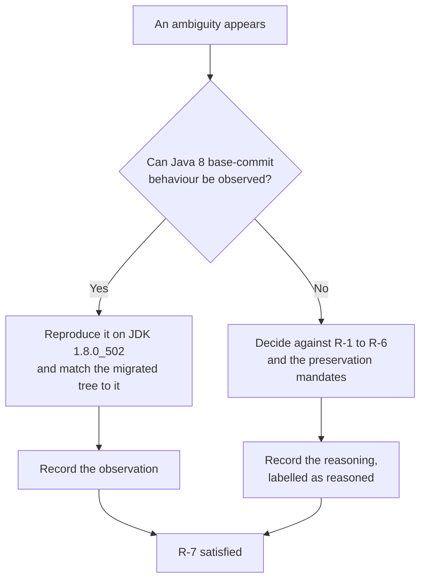

# Behavioural Decisions

This page is the register of every ambiguity the Java 8 to Java 17 and Node 6/8 to Node 20 migration encountered, the resolution it took, and — the part that matters — **the observation that settled it**. A migration of two runtimes with no permitted behavioural change produces a long list of judgement calls, and a conclusion recorded without its evidence is indistinguishable from a preference. So every entry below carries what was observed, or says plainly that observation was not available and gives the reasoning that stood in its place.

!!! note "Spelling, because this set mixes two conventions"
    The prose here uses the British *behaviour* that the rest of this documentation set and [the module overview](../overview.md) use. The **file name is `behavioral-decisions.md`**, American spelling, and the `mkdocs.yml` navigation must name `migration/behavioral-decisions.md` with that exact spelling. The two conventions are deliberately different: a page the navigation does not name is a page the documentation pipeline does not publish, so renaming the file to match the prose would silently unpublish it.

## Where the rules come from

This has to be stated before anything else, because a reader will otherwise look in the wrong place, and because the discrepancy is itself recorded below as conflict [C1](#c1-an-empty-rules-document-and-seven-binding-rules).

- **`review_rules` returns "No user rules provided."** That is the result on a default read and on an explicit full-document read alike. There is **no on-disk rules document** for this project.
- The seven binding rules arrive instead through the **RULES block of the user prompt**. Their full verbatim text is available from the **`review_prompt`** tool, which is the source of record for it.
- They are cited across this documentation set by the stable identifiers **R-1** through **R-7**. This page cites them by identifier and summarises what each requires **of it**; it does not reproduce their text.

The absence of a rules document was not read as licence to lower the standard. Where the rules are silent, the work was held to ordinary enterprise practice instead.

### What each governing rule requires of this page

| Rule | Scope | What it requires here |
| --- | --- | --- |
| **R-7** | All behavioural decisions | **Primary.** This page *is* the record R-7 demands: observed Java 8 base-commit behaviour is the tie-breaker for any ambiguity, and every resolution must be documented with what was observed |
| **R-1** | All manifests and POMs | Every dependency change needs a specific reproduced reason — and every **withdrawal** is a behavioural decision as well as a dependency decision, so the reasoning for holding a version is summarised here. The tables belong to [the dependency inventory](dependency-change-inventory.md) |
| **R-2** | Launch configuration | No production module-access flags except where a pinned dependency documentedly requires one. The Jackson resolution is the sharpest R-7/R-2 intersection in the migration and is recorded here in full; the directive table belongs to [the module-access record](add-opens-exceptions.md) |
| **R-4** | Frontend toolchain | The frontend must genuinely run on Node 20, with no vendored dead packages. That pulls against "replace a build package only if it cannot run on Node 20", which is conflict [C7](#c7-modernise-everything-against-replace-only-what-fails) |
| **R-5** | Test configuration | Failing tests must not be disabled and exclusions are limited to baseline failures, which is conflict [C3](#c3-four-expected-failures-asserted-against-exclusions-limited-to-the-baseline). The accounting belongs to [the baseline record](baseline-test-failures.md) |
| **R-6** | All source | Pre-existing bugs are documented, not fixed, unless one blocks a validation item. The **carve-out boundary** is itself a behavioural decision and is recorded here; the defects themselves belong to [the known-issues register](known-issues.md) |

**R-3**, the prohibition on compiling at release 8 to dodge the migration, is not a governing rule for this page. Its executable proof — the compiler reporting `release 17` and the disappearance of the `-source 8` bootstrap warning — belongs to [the smoke evidence](smoke-evidence.md).

## Method — why a Java 8 baseline was captured

R-7 makes observed base-commit behaviour the tie-breaker. A tie-breaker nobody can consult is aspirational rather than binding, so **a Java 8 runtime was installed alongside the Java 17 target specifically to make R-7 enforceable**: JDK **1.8.0_502** beside JDK **17.0.20**, with Maven **3.8.7** on both sides, Node **v20.20.2** and npm **10.8.2** for the frontend track. Without that second JDK, every question below would have been settled by argument. With it, most of them were settled by running something.

### How the baseline was captured

The base commit is `c8f6226105`, the parent of the first migration commit. Its root POM still declares `<java.version>1.8</java.version>`, expanded into `source`, `target` and `compilerVersion` in two separate plugin blocks, so it is a genuine Java 8 tree and not a Java 17 tree pinned backwards.

- A pristine copy was extracted with `git archive`, **without touching the working tree or the git metadata**. Nothing was checked out, stashed or reset to obtain it.
- The test sources under comparison were verified **byte-identical** to the current tree by checksum, so no conclusion rests on an assumption that the test code stayed still.
- The baseline was built against an **isolated Maven repository with the ArkCase artifacts removed**. This is not a precaution against a hypothetical: building the base commit against the shared local repository fails outright with `class file has wrong version 61.0, should be 52.0`, because migrated Java 17 siblings had already been installed there. Measured that way, the numbers would have described a hybrid of the two trees. The full evidence is in [the baseline record](baseline-test-failures.md).

One disclosure about the runtimes, so that two different pairs of numbers in this documentation set do not read as a contradiction. An earlier capture, taken while the migration was being designed, used JDK **1.8.0_492** and JDK **17.0.19**; it found the same four baseline failures and reached the same conclusions. The validated capture used 1.8.0_502 and 17.0.20. **No resolution on this page depends on the patch level of either JDK**, and both pairs may be encountered across these pages.

### The evidence classes, and one honest limitation

**`web_search` returned no results in this environment on every attempt, and fetching vendor documentation returned empty bodies.** That is stated plainly rather than glossed, because it changes what the claims below rest on: **no claim in this record is sourced from a search result.** Nothing here is "the community recommends" or "the upgrade guide says".

What replaced it is first-party and reproducible:

| Evidence class | What it established |
| --- | --- |
| Registry metadata | `maven-metadata.xml` fetched directly from `repo1.maven.org` to enumerate each artifact's real published version list — **11 of 11** Maven targets confirmed to exist — and `npm view` against `registry.npmjs.org` for the frontend, **26 of 26** confirmed. No floating `latest` and no placeholder version appears anywhere in the change set |
| Published-artifact inspection | **Constant-pool inspection** of the actual jars, which is how the shaded-ASM class-file ceilings inside EasyMock and Spring became facts rather than assumptions |
| Executable probes | Compiler behaviour, agent instrumentation, plugin loading, package installation and Grunt plugin loading each tested on the real toolchains — JDK 1.8.0_502, JDK 17.0.20, Maven 3.8.7, Node v20.20.2, npm 10.8.2 — rather than predicted |
| The migration itself | The complete change set applied end to end, driven to a green state on both tracks. Several blockers below are visible only that way, and one is visible only on a clean full-reactor build |

### How to read an entry

Each resolution is labelled by the kind of evidence behind it, because conflating the two would be the easiest way to overstate this record:

- **Observed** — settled by running something and reading the result: a test run on both JVMs, a load probe, a registry query, a build that failed or passed.
- **Reasoned** — no observation could settle it, so it was decided against a rule, a preservation mandate or the structure of the repository, and the reasoning is given in place of an observation. Three entries are of this kind and each says so.

## The resolutions at a glance

Nineteen decisions, grouped below by the surface they touch. This index is a summary; the observation is the deliverable and lives in the subsection.

| # | Ambiguity | Resolution | Evidence |
| --- | --- | --- | --- |
| 1 | Are the four failing tests baseline failures or migration regressions? | baseline failures | observed |
| 2 | Are the two AWS SDK PowerMock tests baseline failures too? | no — regressions, so they were **fixed**, not excluded | observed |
| 3 | How should Jackson's `java.time` handling be preserved? | a test-scope directive, **not** a registered Java-time module | reasoned, with corroborating code |
| 4 | Should the OpenCMIS JAX-WS and JAXB runtime exclusions be dropped? | retained, with the JAXB runtime supplied explicitly | observed |
| 5 | How should the encapsulated JNDI class literal be replaced? | by the identical fully-qualified **name**, held as data | observed |
| 6 | What should the two new event-multicaster methods do? | delegate to both; no-op respectively | observed |
| 7 | Should a JAX-WS artifact be reinstated? | no — deliberately omitted, omission recorded | observed |
| 8 | Which Maven candidates should be held? | nine withdrawn | observed |
| 9 | Should the template renderer and glob library be upgraded? | no — both held | observed |
| 10 | Should the minifiers be modernised? | no | observed |
| 11 | Which frontend packages should move? | only those that provably fail, plus forced peers | observed |
| 12 | What happens to `ui-grid-draggable-rows` 0.2.2? | 0.3.3 — a forced delta, not a chosen one | observed |
| 13 | Which `sass` version? | `~1.77.8`, and the tilde is load-bearing | observed |
| 14 | Should the vendored `lib/` tree become registry dependencies? | no — retained verbatim | observed |
| 15 | Should the missing generated profiles module be fixed? | yes — the single permitted carve-out | observed |
| 16 | Where is the `frontend` directory the build step names? | it does not exist; read as the frontend project root | reasoned |
| 17 | `export JAVA_HOME=` was supplied empty | read as a placeholder for the JDK 17 home | reasoned |
| 18 | Is `docs/setup.md:167` a real location? | no — the file is 125 lines | observed |
| 19 | Is `acm-user-interface/` a second frontend surface? | no | observed |

## Resolutions — the test surface

### 1. The four failing tests are baseline failures

**Resolution.** Three EasyMock verification failures in `FileDownloadAPIControllerTest` and one `NullPointerException` in `FolderCompressorTest` are **pre-existing defects of the base commit**, not damage the migration did. They are therefore the exclusions R-5 permits, and under R-6 they are documented rather than repaired.

**The observation.** Run at the base commit on JDK 1.8.0_502, they fail **identically** to JDK 17, differing only in library-internal line numbers. The controller failure is raised at `EasyMockSupport.verifyAll` line 523 on *both* JVMs, entered from the same three test lines on both. For the compressor, the exception type, the message and the entire call chain match; only the line numbers inside `java.util.zip` move, and JDK 17 additionally prefixes those frames with its `java.base/` module name.

That observation licenses a second conclusion which is worth stating because it removes an obvious suspicion. The controller failure is an EasyMock verification failure, and this migration moves `easymock` from 4.1 to 4.3. **If the upgrade had altered the outcome, these would be migration regressions rather than baseline failures.** The verification fails at the same frame, at the same line, from the same three test methods, under both the old and the new EasyMock — so the upgrade changed neither outcome. The full frame-by-frame comparison is in [the baseline record](baseline-test-failures.md), which owns the suite totals and the collateral cost of the two class-level exclusions.

### 2. The two AWS SDK tests are regressions, not baseline failures

**Resolution.** `AWSTranscribeServiceTest` and `AWSComprehendMedicalServiceTest` failed on JDK 17 when the change set was first applied. **R-5 did not permit excluding them**, so they were **fixed**.

**The observation.** Both **pass on Java 8** — 6 run and 8 run respectively, no failures and no errors. That single measurement is what reclassified them: a JDK 17 failure that also fails on Java 8 is a pre-existing defect and may be excluded and recorded; a JDK 17 failure that passes on Java 8 is a regression the migration introduced and must be repaired. They were fixed by adding the module-access directives their own stack traces named, and both then went fully green with their assertions untouched.

This is the clearest case on the page of the baseline earning its keep. Excluding two failing tests would have been the cheap route and would have looked identical in a build log to excluding the four that are genuinely pre-existing. Only the Java 8 run distinguishes them.

## Resolutions — the Java 17 surface

### 3. Jackson's `java.time` handling is preserved with a directive, not a module

**Resolution.** A **test-scope** `--add-opens java.base/java.time` directive, and explicitly **not** a registered Java-time module on the mappers that reflect into `java.time`.

**Why this is the sharpest R-7 and R-2 intersection in the migration.** R-2 pushes toward eliminating module-access flags, and this one has an obvious elimination: register a `JavaTimeModule`, and the reflection that needs the flag stops happening. It was rejected because it would change what ArkCase emits. Registering a module there turns a field-based JSON object into an ISO-8601 string — a change to an emitted payload shape, which the REST-contract preservation mandate forbids and which R-7 independently settles against, since the field-based shape is the observed behaviour of the Java 8 base commit.

**Labelled honestly: this one is reasoned, not observed.** The affected test asserts only that the `dateGenerated` node is *present*, so it would have passed either way — there is no red test behind the decision, and pretending otherwise would be exactly the kind of dressing-up this page is meant to avoid. What *is* observable is the corroborating evidence in the codebase rather than in an argument: `ObjectConverter` in `acm-tool-integrations/acm-object-converter` **does** register a `JavaTimeModule`, disables `WRITE_DATES_AS_TIMESTAMPS` and installs an explicit `yyyy-MM-dd'T'HH:mm:ss.SSS'Z'` formatter. Where ISO-8601 strings are the intended contract, this codebase says so deliberately. The mapper that needs the directive deliberately does not — which is precisely why Jackson reflects over the fields of its `LocalDateTime`. The alternative was therefore rejected **on rule grounds, not convenience**, and the per-directive attribution lives in [the module-access record](add-opens-exceptions.md).

### 4. The OpenCMIS runtime exclusions are retained

**Resolution.** The OpenCMIS client's exclusions of the JAX-WS and JAXB runtimes are **kept exactly as the base commit wrote them**, in both places that declare them, and the JAXB runtime is supplied explicitly at the top level instead.

**Why the question arose at all.** On Java 8 the exclusions were harmless, because the JDK supplied both runtimes. On Java 17 the JDK supplies neither, so an exclusion that used to be a de-duplication became a potentially load-bearing removal. Reshuffling them was a real candidate.

**The observation.** ArkCase configures the **ATOMPUB** CMIS binding rather than the web-services binding, so no JAX-WS runtime is on the hot path — the binding constants say so in the source, not in a comment. And the confirming measurement: the full configured unit suite is **green with the exclusions in place**. Supplying the JAXB runtime explicitly makes what the Java 8 JDK provided implicitly into a declared dependency, which is the same behaviour with the provenance made visible.

### 5. The encapsulated JNDI class literal becomes the identical name, held as data

**Resolution.** The compile-time class literal on the JDK-internal LDAP context factory becomes the **identical fully-qualified class name**, loaded from a properties resource by a small package-private loader. The JNDI provider string does not change, so JNDI resolves the same provider it always did.

**The observation that makes this exactly equivalent.** The field's only functional consumption anywhere in the repository is the fully-qualified-name lookup — `getName()` on the class object. **Only the name was ever used.** A repository-wide search confirmed nothing outside the file references the getter or the setter, the only subclass does not touch it, and no Spring XML sets the property. Holding the name as a string is therefore not an approximation of the previous behaviour; it is the same value reaching the same consumer.

Three independent probes established that the change was unavoidable rather than stylistic, and one of them is corroborating evidence for a different rule entirely: `javac --release 17` reports the package is not visible because `java.naming` does not export it; `javac --release 8` on a 17 JVM reports that the package does not exist — so **the release-8 escape hatch R-3 forbids would not have rescued this file either**; and real JDK 8 `javac` compiles it with only an internal-proprietary-API warning. The classification of all seven audit hits is in [the static audit](static-audit.md).

**One consequence, disclosed rather than buried.** The LDAP connection-pooling flag stops being a compile-time constant when it moves into the same properties resource. That was verified safe by enumeration: its only three uses are inside the same class, so no other compilation unit could have inlined it.

### 6. The two event-multicaster methods follow the class's own conventions

**Resolution.** Moving Spring to 5.3.39 makes a hand-written `ApplicationEventMulticaster` implementation stop compiling, because Spring 5.3.5 added two methods to that interface. `removeApplicationListeners(Predicate)` **delegates to both wrapped multicasters**; `removeApplicationListenerBeans(Predicate)` is a **no-op**.

**The observation.** The conventions were read out of the class rather than invented for it. In `DistributiveEventMulticaster`, the pre-existing `removeApplicationListener(ApplicationListener)` already delegates to both the asynchronous and the synchronous multicaster, and the pre-existing `removeApplicationListenerBean(String)` is already literally a no-op whose body is the comment `// do nothing` — because this multicaster does not track listener bean names at all. Each new method is the predicate-taking sibling of an existing one, so each inherits that method's behaviour and nothing more. No new capability was introduced by a compilation fix.

Two details are worth recording for anyone re-treading this. First, this change and the Spring bump are **inseparable**: the bump without it does not compile. Second, the coupling is **invisible on an incremental build** — it surfaces only when the owning module is recompiled from clean, which is one of two blockers a full clean build revealed and a resumed build hid.

### 7. JAX-WS is deliberately not reinstated

**Resolution.** The Track A specification names JAX-WS among the removed EE modules to reinstate. **It is deliberately omitted, and the omission is recorded** — which is why it appears here rather than only in a dependency table.

**The observation.** Measurement found **zero** `javax.xml.ws`, `javax.jws` and `javax.xml.soap` imports anywhere in the repository; no WSDL files; no `@WebService` or `@WebMethod` annotations; no CXF; and no `wsimport` plugin. The full build and the full configured test suite are green without a JAX-WS artifact.

**Why omitting it is the rule-compliant answer rather than a shortcut.** Adding an artifact with no consumer is a dependency change with no reproduced failure behind it, which is exactly what R-1 forbids. Honouring one instruction literally would have violated another, and R-1's evidence standard is the one that can be tested. A related finding kept the reasoning honest: `javax.xml.rpc.ServiceException`, imported by two classes in the billing service, is satisfied by a third-party JAX-RPC artifact already declared in the root POM. JAX-RPC was never part of the JDK, so it is not a removed-module problem at all — and mistaking it for one would have produced a phantom justification for the artifact this entry declines to add. The reinstated surface stays `javax`-namespaced throughout; see [C4](#c4-no-jakarta-namespace-against-javax-modules-the-jdk-removed).

### 8. Nine Maven candidates were examined and withdrawn

**Resolution.** Nine version bumps that a "Java 8 to 17" checklist would recommend were **formally withdrawn**: the standalone ASM, EclipseLink, AspectJ, Mockito, PowerMock, JaCoCo, Javassist, a group of six libraries including JUnit and Jackson, and four hard-pinned artifacts. Only three dependency versions and four build plugins moved.

**The shared observation.** The full reactor builds and the configured unit suite is green with **every one of them untouched**. Under R-1 that is what makes each withdrawal a decision rather than an omission — there is no reproduced failure to attach to any of them.

Two are worth surfacing here because the reasoning is behavioural rather than clerical:

- **The standalone ASM was never the failing reader.** Static probing did confirm that the pinned version cannot read a class-file major 61 and that a much later version is the first that can, so the candidate was real. But both actual failures came from **shaded copies** of ASM inside EasyMock and Spring, which are invisible to the top-level property and which their own upgrades fix. Raising the property would have looked like the fix while changing nothing about either failure.
- **Javassist is the one place the evidence has a stated limit.** It reads and re-emits a major-61 class correctly on JDK 17, which is the observation. But it reads and writes class-file versions numerically, so its named version constants stop at Java 11 in every recent release and yield no "Java 17" marker either way. The decision therefore rests on the executed suite rather than on a constant, and saying so is more useful than implying a cleaner proof.

Each withdrawal is recorded with the reason it was examined in [the dependency inventory](dependency-change-inventory.md), so nobody repeats the investigation. This page does not restate those tables.

## Resolutions — the frontend surface

### 9. The template renderer and the glob library are held

**Resolution.** `nunjucks` and `glob` stay at the versions the base-commit manifest declared. Neither is upgraded.

**The observation.** A per-plugin load probe under the original Grunt on Node v20.20.2 showed both **load and behave correctly**, so there was no failure to justify moving either. Two negative findings were recorded alongside the probe, because they are the reason the withdrawal is safe rather than merely convenient: the one behavioural difference a newer glob major introduces — a dropped trailing slash — is provably benign here, because every consumer either joins the path or copies through a filesystem call; and the renderer's escaping behaviour never comes into question because the version does not move.

**Why holding is strictly better than upgrading-and-preserving.** The rendered `home.html` is a pipeline output, so its HTML-escaping contract is part of what must not change. Holding the renderer makes that contract **untouched rather than merely preserved** — there is no compatibility argument to get wrong. The same applies to glob's result ordering, which decides the order of the emitted asset lists. This is also the single reason `Gruntfile.js` needs no change at all: its diff against the base commit is **zero bytes**, with the task graph and every output name intact.

### 10. The minifiers are not modernised

**Resolution.** `grunt-contrib-uglify` and `grunt-contrib-cssmin` stay at their base-commit versions, so the shipped minified bytes are produced by the tooling the Java 8 base commit declared.

**The observation, and it is the decisive one on the frontend track.** A wider-upgrade variant of the change set was built and the two output sets compared. Three artifacts came out **byte-identical** across both variants — the annotated bundle, the vendor bundle and the rendered `home.html`, the last matching to the script tag. The only two that differed were the two a minifier produces: the minified JavaScript and the minified CSS. In other words, the entire output difference between a minimal change set and a modernised one is attributable to swapping minifiers, and nothing else in the pipeline moves. The committed lockfile resolves the held plugins to the same underlying minifier engines the base commit used.

Under both the outputs-stay-equivalent requirement and R-7's base-commit tie-breaker, that makes holding them the strongest fidelity claim available. The figures are in [the smoke evidence](smoke-evidence.md).

!!! warning "The claim is identical tooling, not identical bytes against Node 8"
    A byte-for-byte comparison against a **Node 8 baseline build was not possible**: the original toolchain cannot install on Node 20 at all, and no Node 8 runtime was available to produce the other side of the comparison. So the claim is precisely that the minifiers producing the shipped bytes are the versions the base-commit manifest declared. It is **not** a claim that those bytes were diffed against a Node 8 build, and it must not be read as one. This is the one place on the frontend track where R-7's tie-breaker could not be observed directly, and the honest substitute is tooling identity.

### 11. Only the packages that provably fail move

**Resolution.** Two packages are replaced because they provably fail on Node 20, four more move only as forced peer consequences, and the rest of the build toolchain is held. Six changes in total, from an intended eighteen.

**The observation.** Each candidate was probed individually rather than judged as a group, and the failures turned out to be of two different kinds, neither of which is "the package is too old":

- One fails at **install** time. Its transitive native SASS binding's `node-gyp` generation fails outright on Node 20. The framing matters and is recorded rather than smoothed: this is an install-time failure, not a task failure — the SASS task is commented out in the Gruntfile — but it blocks `npm ci`, which is a named validation item, so a dormant task is no defence.
- One fails at **load** time, throwing `TypeError: Cannot read properties of undefined (reading 'length')` while loading its own task file.

Two further measurements decided the rest. **Installing the whole original dependency set minus the one install-blocking package succeeded outright**, which is what disproved the assumption that the toolchain as a whole was incompatible. And of twelve probed Grunt-ecosystem packages, **ten loaded cleanly** on Node 20 under the new Grunt and were withdrawn as candidates. That is how conflict [C7](#c7-modernise-everything-against-replace-only-what-fails) was broken: by measuring each package rather than by choosing a side.

The four peer moves are consequences, not choices: the replacement SASS plugin's peer requirement forces the Grunt major, the Grunt major forces its CLI, and one plugin — the only one in the set that **pinned** the old Grunt line rather than declaring a floor — forces its own major to resolve at all. A peer audit across the whole plugin set confirmed it was the only one.

### 12. `ui-grid-draggable-rows` moved versions, and the move was forced

**Resolution.** The base-commit exact pin becomes `0.3.3`. This is the **only version delta in the registry-alias set**, and it was forced rather than chosen.

**The observation.** The base-commit pin **was never published to the registry**, verified directly: the registry holds only `0.3.0`, `0.3.1`, `0.3.2` and `0.3.3`. The base commit pinned a repository tag that has no registry counterpart, so once the package must come from the registry — because the GitHub repository publishes no manifest at that tag — *any* registry version is a forced minor bump. The manifest takes `0.3.3`, the **newest of the four published**.

A correction belongs on the record here, because an earlier statement of this decision said 0.3.3 was "the lowest available" and that is wrong: `0.3.0` is the lowest. The substance is unaffected — the delta is forced either way — but the reason is now stated accurately, and [the dependency inventory](dependency-change-inventory.md) carries the same correction.

### 13. `sass` is pinned with a tilde, and the tilde is load-bearing

**Resolution.** The new dart-SASS peer is declared as `~1.77.8`. The tilde is not stylistic.

**The observation, and it is only visible to a strict install.** `npm install` tolerates the resolution that a caret range produces; **`npm ci` does not**, rejecting the tree with a message of the form `lock file's chokidar@5.0.0 does not satisfy chokidar@3.6.0`. Since `npm ci` is the named validation item, the range has to hold the resolved file-watcher inside what the committed lockfile records.

Two precisions, because the boundary was mis-stated once and a wrong boundary would invite a "harmless" caret:

- The watcher range is declared identically **up to and including 1.78.0** and moves at **1.79.0** — so the boundary is 1.79.0, not 1.78. The tilde holds SASS inside `1.77.x`, comfortably below it.
- The committed lockfile carries **two watcher copies, not one hoisted copy** — one at the top level for the template renderer and one nested under SASS. The tilde's function is to keep the recorded tree **reproducible under strict validation**, not to collapse the two into one.

This entry is the clearest example of why the lockfile had to come from a **real** install. A dependency tree computed without fetching tarballs or running lifecycle scripts resolves this conflict silently and reports success.

### 14. The vendored `lib/` tree is retained verbatim

**Resolution.** Six directories of checked-in JavaScript under the frontend root are **retained**, with a zero-byte diff. None is promoted to a registry dependency.

**Why the question is a real one.** A careless reading of R-4's no-vendored-dead-packages requirement would treat checked-in dependency code as exactly what the rule forbids. The retention is therefore argued rather than assumed.

**The observations.** Two of the six are required by **relative path** from the Gruntfile — by path, not by package name — so `node_modules` is never consulted for them. Adding registry copies would create two divergent implementations of the same code with only the Gruntfile deciding which one runs, which is strictly worse than the status quo. One of the two is an **ArkCase fork with no upstream equivalent**, so "replace the vendored copy with a dependency" has no target to point at. And the tree is deployed rather than dormant: it appears on three separate copy lists in the deploy-time Spring configuration and is explicitly whitelisted from the temp-folder prune.

The conclusion is the one the rule actually asks for: this is **first-party in-repo source**, not a vendored dead package. R-4's target is dead weight, and the eight genuinely dead build packages it *did* reach were removed. [The known-issues register](known-issues.md) carries the full argument.

### 15. The generated profiles module is the single permitted carve-out

**Resolution.** R-6 says document, do not fix. **Exactly one** condition was fixed: the frontend configuration's unconditional top-level `require` of a generated module that no checkout contains.

**The observation that makes it a permitted exception rather than a violation.** The module is written at deploy time by the Java resource copier, immediately before Grunt is invoked; it is untracked and absent from a fresh checkout. The file that requires it is loaded by the **first** task in the default chain, so an unresolvable require aborts the whole run before any task executes. A bare checkout therefore **cannot run `npm run build` at all** — which directly blocks a named validation item, and that is precisely the exception R-6 contemplates. Nothing else the migration found is in that position.

The fix is deliberately two narrow parts: a prebuild helper that writes the manifest **only when it is absent**, emitting the identical content the Java assembler produces, and a **guarded require** that defaults to the same single-profile value the assembler emits — defaulting only on a module-not-found for its own require and re-throwing everything else, so a generated module that exists but does not parse still surfaces its real error instead of silently becoming a default. A deployed WAR and a bare checkout follow the same code path, and the generated module wins whenever it is present, so deployed behaviour is unchanged.

**The contrast that proves the line was drawn deliberately.** An adjacent warning was left **unfixed**: the last task in the same chain writes a manifest into a directory that also exists only at deploy time, logs an `ENOENT` warning in a bare checkout, and is absorbed by the Gruntfile's force option. It is cosmetically annoying in exactly the same way as the carve-out and it is one line from the same class of fix — and it stays, because it blocks nothing. A carve-out with no visible boundary is indistinguishable from a licence to fix whatever is convenient; this is the boundary.

## Resolutions — reading the instructions

### 16. The `frontend` directory does not exist

**Resolution.** The Track B build step is written `git clean -xfd frontend && cd frontend && npm ci && npm run build`. There is **no `./frontend`** in this repository. It is read as "the frontend project root", which resolves to `acm-standard-applications/arkcase/src/main/webapp/resources`, and the frontend is **not relocated** there.

**Labelled honestly: reasoned, not observed.** No observation can tell you what a path in an instruction was meant to name. What observation *can* establish is the cost of the alternative, and that is what settled it: relocating the tree would change the entry points and the asset layout, which the outputs-stay-equivalent requirement forbids, and it would break the Maven WAR packaging that consumes `src/main/webapp/resources`. Reading the instruction literally would have violated a preservation mandate to satisfy a directory name. One operational addition is recorded rather than hidden: the install runs with `--ignore-scripts`, because a git-sourced asset repository's `prepare` script attempts to build an ancient native module that cannot compile on Node 20.

### 17. `export JAVA_HOME=` was supplied empty

**Resolution.** The Track A build step is written `export JAVA_HOME=` with no value. It is treated as a **placeholder for the JDK 17 installation directory**, and the command pair is otherwise used exactly as written.

**Labelled honestly: reasoned, not observed.** The reasoning is that every other element of the step presupposes a JDK 17 toolchain, and an empty `JAVA_HOME` would select whatever the environment defaults to — which would make the acceptance criterion untestable rather than strict. Substituting the JDK 17 home is the only reading under which the step means anything. What *was* observed is that both halves of the pair exit 0 on the migrated tree with that substitution.

### 18. `docs/setup.md:167` is out of range

**Resolution.** The citation points past the end of the file. At the base commit `docs/setup.md` is **125 lines**; after the migration's prerequisite edits it is 126. Either way there is no line 167.

**The observation.** The line count was read from the base-commit blob directly rather than from the working tree, so the finding does not depend on the migration's own edits to that file.

**Why it changes nothing.** The credential the citation refers to is out of scope, was not sought and was not read. The discrepancy is recorded only so that a reader who goes looking for it knows it is a citation error and not a missing file.

### 19. `acm-user-interface/` is not a second frontend surface

**Resolution.** There is exactly **one** frontend surface, and it is the `resources/` tree. `acm-user-interface` participates only as the **deploy-time driver** of that tree.

**The observation.** The module holds **five tracked files at the base commit** — two POMs, two Java sources and one Spring configuration — and **no JavaScript and no `package.json` at any depth**, counted from the git index rather than from a directory listing. Its role in this migration is confined to that of a driver: its Spring configuration invokes the install and the Grunt build at webapp startup, and its resource copier writes the generated manifest and prunes the temp folder.

A precision worth recording, since an earlier statement of this finding described the five as "two POMs and three Java sources". The composition is two POMs, **two** Java sources and one Spring XML; the file *count* of five was right and only the breakdown was wrong. In the migrated tree the module holds **seven** files, because the change set added two test classes to cover its own edits — which is a reason to state the count with the tree it was taken from rather than as a bare number. Those two files were changed to invoke `npm ci` instead of `yarn` and to name the npm lockfile, because leaving them on yarn would have made the whole frontend migration cosmetic — the deployed application would still have shelled out to the retired package manager.

The naming is the trap: a module called "user interface" that contains no user-interface code. [The module overview](../overview.md) describes it as front-end resources, which is a directory map's summary rather than a statement about where the build lives.

## Figures this record withdraws

One resolution governs every number on these pages, and it is the most consequential application of R-7 in the whole set: **where a figure carried through planning disagreed with a measurement taken against the real checkout, the measurement won and the planning figure was named rather than quietly replaced.** A reader who has seen the earlier numbers needs to know which value is authoritative and why.

| Withdrawn figure | Authoritative value | Owned by |
| --- | --- | --- |
| 274 reactor modules | **142** — the transitive closure of the root POM's `<modules>`. Only 145 POM files exist in the repository, three of them outside the reactor, so 274 was never reachable | [Dependency inventory](dependency-change-inventory.md), [Smoke evidence](smoke-evidence.md) |
| 142 test-bearing modules | **79** modules carry test sources. 142 is the size of the whole reactor; most entries are aggregators or hold main sources only | [Dependency inventory](dependency-change-inventory.md) |
| 773 tests, 0 skipped | **918** tests, 0 failures, 0 errors, **21 skipped** — read from surefire's own XML reports. The totals moved because tests were **added**, never because any test was disabled; the 21 skips are pre-existing `@Ignore` annotations in unchanged baseline sources, so a zero-skip run is not reachable from this configuration | [Baseline test failures](baseline-test-failures.md) |
| 780 unexcluded, 3 failures + 1 error | **925** unexcluded, 3 failures + 1 error. The invariant these figures were cited for is unchanged and is the part that matters: the gap between the unexcluded and configured runs is still **exactly seven**, still decomposing as 4 baseline failures + 3 incidentally-skipped passing siblings | [Baseline test failures](baseline-test-failures.md) |
| 893 tests | withdrawn outright as a **grep artifact** — a count of matching text in build output rather than a total any test runner reported. It never described an executed suite | [Baseline test failures](baseline-test-failures.md) |
| Seven audit hits across "four files" | **seven hits across five files**, and this is the one planning figure measurement *confirmed* rather than corrected — the hit count was right and only the file count was wrong, because one source file carries three of the seven on its own | [Static audit](static-audit.md) |
| A WAR of 277,005,095 bytes | **277,014,616 bytes**. Both are real counts of the same source; embedded archive timestamps and the licence plugin's year stamp move the digits between builds, so the durable claim is the magnitude — roughly 264 MB — and not the digits | [Known issues](known-issues.md) |
| "Twelve withdrawn frontend upgrades" | **twelve** names the load-probe set; counted as withdrawals the enumerable total is **fourteen** — the ten probed packages that were cleared and held, plus four packages examined as Node-API risks. The remaining two probe-set members are the forced replacements, not withdrawals | [Dependency inventory](dependency-change-inventory.md) |

Two smaller corrections are recorded with their entries above rather than here, because the reasoning changes and not just a number: the forced `ui-grid-draggable-rows` version is the **newest** of four published rather than the lowest available, and the SASS file-watcher boundary is **1.79.0** with **two** watcher copies in the lockfile rather than one hoisted copy.

## Conflicts and their resolutions

Seven conflicts, with stable identifiers because they are cited by ID from elsewhere in this documentation set. Each is a genuine collision between two instructions that are individually reasonable, and none was resolved by ignoring one side.

| ID | The collision |
| --- | --- |
| [C1](#c1-an-empty-rules-document-and-seven-binding-rules) | An empty rules document, and seven binding rules |
| [C2](#c2-no-production-flags-against-stacks-that-need-reflective-access) | No production module-access flags, against stacks that need reflective access |
| [C3](#c3-four-expected-failures-asserted-against-exclusions-limited-to-the-baseline) | Four expected failures asserted, against exclusions limited to the baseline |
| [C4](#c4-no-jakarta-namespace-against-javax-modules-the-jdk-removed) | No `jakarta` namespace, against `javax` modules the JDK removed |
| [C5](#c5-a-reduced-local-stack-against-live-round-trip-validation) | A reduced local stack, against live round-trip validation |
| [C6](#c6-change-nothing-in-the-checkout-against-a-deliverable-of-checkout-changes) | "Change nothing in the checkout", against a deliverable of checkout changes |
| [C7](#c7-modernise-everything-against-replace-only-what-fails) | Modernise everything, against replace only what fails |

### C1. An empty rules document and seven binding rules

**The conflict.** `review_rules` reports that no user rules were provided, yet the user prompt carries a RULES block of seven binding constraints. Taken at face value, the first says there is nothing to comply with and the second says there are seven things.

**The resolution.** Document both facts plainly and treat the prompt's rules as **fully binding**. They are user directives delivered through a different channel, not inventions, and pretending no rules exist would discard explicit instructions — the worse of the two errors by a wide margin. Their full verbatim text is available via `review_prompt`, which is why every page in this set cites them by the identifiers **R-1** through **R-7** and none reproduces their text: the prompt is the source of truth, and a paraphrase in a document would drift from it.

The reason this is recorded rather than silently worked around is that the absent rules document is exactly the kind of finding that looks like an oversight later. It is not. It was verified twice, including with an explicit full-document read.

### C2. No production flags against stacks that need reflective access

**The conflict.** R-2 forbids module-access flags in production launch configuration, while the bytecode and mocking stacks genuinely need deep reflective access on JDK 17 — JEP 396 made that access permission-gated rather than merely warned about.

**The resolution, which came out better than planned.** Upgrade first wherever a reproduced failure proves an upgrade sufficient, and confine every unavoidable directive to **test scope**. The result is **zero** production exceptions and **eight** fully attributed test-scope directives, every one traced to the library that demanded it and the exact stack frame that failed without it. The production launch configuration published in the README and the developer setup guide runs as written on Java 17 and grants no access to JDK internals — a property the base commit had and the migration preserved rather than spent.

The two upgrades that this resolution rests on are worth naming, because they are the difference between eight directives and a much longer list: the mocking library and the framework each ship their **own shaded copy** of the bytecode reader, and each shaded copy — not the top-level reader — was the thing that could not read a class-file major 61. Upgrading the owning library fixed what no flag would have fixed. [The module-access record](add-opens-exceptions.md) owns the directive table and the scope argument.

### C3. Four expected failures asserted against exclusions limited to the baseline

**The conflict.** The project setup instructions assert that exactly four unit-test failures are expected. R-5 permits exclusions only for failures present at baseline. An assertion is not a measurement, and accepting it as one would have been a way to launder whatever failed.

**The resolution, by measurement.** There are **exactly four**, and they are the permitted exclusions. The two additional failures that appeared on JDK 17 were **fixed rather than excluded**, because they pass on Java 8 and R-5 therefore did not permit excluding them. The strongest form of the R-5 claim available was also measured: with the exclusions removed, the only two classes reporting any failure or error across the entire suite are the two that are excluded — so the exclusion list is not merely *limited to* baseline failures, it is *exactly* the set of classes that still fail, and no regression is hiding behind it. The accounting, the two rejected narrower mechanisms and the honest collateral cost of the two class-level exclusions belong to [the baseline record](baseline-test-failures.md).

### C4. No jakarta namespace against javax modules the JDK removed

**The conflict.** The requirements exclude the `jakarta` namespace in any form, yet Java 11 removed under JEP 320 exactly the EE modules this codebase compiles against — and the successor artifacts for those APIs are `jakarta`-namespaced.

**The resolution.** Reinstate the removed APIs as **standalone `javax`-namespaced artifacts**, declared once in the root POM's global dependency block and inherited by every module. Every one of the **137** `javax.xml.bind` import lines across **84** files in **21** modules stays byte-identical, the four `javax.annotation` and eight `javax.activation` imports likewise, and **no `jakarta` rename occurs anywhere**. Both the API and a runtime provider were needed, because the code uses contexts, marshallers and unmarshallers rather than annotations alone — and the provider was held to the last generation that still exposes the `javax` packages, since the next major version is where the namespace switches.

**With one deliberate, documented deviation**, which is [resolution 7](#7-jax-ws-is-deliberately-not-reinstated): the specification names JAX-WS among the modules to reinstate, and it is omitted because the codebase contains no consumer for it and adding an unjustified artifact would violate R-1.

### C5. A reduced local stack against live round-trip validation

**The conflict.** The setup instructions deliberately skip Alfresco, Solr and Pentaho and replace Active Directory with a local directory server, and state that credentials for the omitted systems will never be provided. The validation framework asks for live round-trips through those very services.

**The resolution.** Preserve the integration surface at the code and wire level — **every client library and version on those paths is unchanged by this migration**, as are the configuration keys and the REST surface — and record the live round-trips as **environment-constrained** rather than claiming them. There is no mechanism by which a toolchain move that leaves every client version untouched could alter wire behaviour, and the argument is reinforced by the green unit suite exercising the client-facing service and controller layers. What was directly exercisable *was* exercised, including the authenticated login flow against the local directory server. [The smoke evidence](smoke-evidence.md) states the reduced-stack rationale in full rather than glossing it, which is the point: an unverified item recorded as unverified is evidence, and one recorded as verified is not.

### C6. "Change nothing in the checkout" against a deliverable of checkout changes

**The conflict.** The setup instructions say to make all changes outside the checkout. This migration's entire deliverable is edits to POMs, sources, manifests and documentation inside it.

**The resolution.** The instruction scopes to **environment** configuration — the external configuration bundle, the directory server, the database, the Tomcat instance and the external XSD rewrite. Those are the things that must not be baked into the repository, and none of them is. Repository changes are the deliverable and are made deliberately.

The accompanying discipline is not theoretical, which is why it is recorded here rather than treated as boilerplate: **`git add -A` is never used and staging is by explicit path.** Two independent conditions make a blanket stage actively dangerous in this tree. The build's licence plugin, bound to `process-sources`, injects the ArkCase header into **six** tracked main sources that lack one, stamped with the current year, so any build leaves unrelated modifications in the working tree. And the pipeline writes generated frontend paths that are untracked and **not** ignored, so a post-build status shows three untracked generated paths. A blanket stage would sweep both into a migration commit.

### C7. Modernise everything against replace only what fails

**The conflict.** R-4's no-vendored-dead-packages requirement pulls toward wholesale modernisation of the frontend toolchain. The specification's "replace a build package only if it cannot run on Node 20" pulls the other way. Both are binding.

**The resolution, by measuring per-package failure rather than choosing a side.** Replace the **two** that provably fail, accept the **four** that move as forced peer consequences, withdraw the other twelve candidates, and remove only packages that are genuinely unreferenced — **22** of them, of which the eight dead build packages are cleanup that R-4 demands and are explicitly *not* claimed as compatibility fixes, since most of them still install on Node 20 perfectly well.

What that cost and what it saved, stated in both directions:

- **It saved** the shipped bytes. Holding the two minifiers means the minified output comes from base-commit tooling; holding the renderer and glob means the escaping and ordering behaviours are untouched; and together those are why `Gruntfile.js` has a **zero-byte diff**. An intended eighteen upgrades became six.
- **It cost** an easy claim to modernity. The toolchain is still a Grunt toolchain, and several held packages are years behind their current releases. That is a deliberate trade: R-7 makes base-commit behaviour the tie-breaker, and every avoided upgrade is one fewer opportunity to change an output. Modernising the pipeline is a legitimate project — it is simply not this one, and doing it here would have made the fidelity argument above unavailable.

## Recommended follow-up, deliberately not adopted

Two paths were identified during the migration that would leave the tree tidier, and both were declined. [The module-access record](add-opens-exceptions.md) explicitly defers them here, so this is where the reasoning lives.

**Retiring PowerMock would reduce eight directives to two.** Migrating the PowerMock unit-test classes to Mockito's inline static mocking would remove the five reflection-driven `java.base` opens *and* the `java.xml` export — PowerMock's own class loader is what creates the unnamed-module mismatch, so removing PowerMock removes the mismatch with it. Six of the eight would go. The two that would remain are the Jackson `java.time` open and the `java.lang` open that CGLIB needs inside EasyMock, and the second of those is **not** narrowly held: **213** test sources use EasyMock, so no PowerMock work touches it.

**Why it is not adopted.** It means adding a mocking artefact that appears in no POM in this repository, which is a dependency change with no reproduced failure behind it and therefore exactly what **R-1** forbids. And it means rewriting working test classes, when the migration modified **zero** of the base commit's 402 test sources — a preservation mandate in its own right. Trading a rule-compliant flag list for a rule violation is not an improvement. One detail would also trip a partial attempt: an integration test uses PowerMock too and runs under failsafe, so the failsafe directives survive until it is migrated as well, making this a six-class job rather than a five-class one. The recommendation stands for whenever test maintenance is the goal rather than a side effect of a runtime migration.

**The narrower alternative, also declined.** Both affected test classes already carry a PowerMock ignore-list annotation, and that list demonstrably does not cover the XML packages. Widening it would keep the JAXP factory finder out of PowerMock's class loader and fix the XML case with **no JVM flag at all** — a genuinely smaller change to the command line. It was declined because it **edits test source and the JVM directive edits none**: one flag in a build file that is documented here is a better trade than an annotation change in two test classes that is not. It is recorded because it exists, not because it was unattractive.

## What was deliberately not decided

Silence is easy to mistake for a decision, so the questions this migration did **not** answer are named.

| Question | Why it is not decided here |
| --- | --- |
| Is anything faster? | **No performance or scalability change was attempted, and none is claimed.** This is a compatibility migration; any measured difference would be an unintended side effect of the runtime move rather than a goal. No benchmark was taken and none should be inferred |
| Should the coverage floor rise? | The JaCoCo line-coverage floor stays at the **2%** the base commit configured, deliberately **not raised opportunistically**. The low value is not something this migration introduced. Raising it is a coverage initiative with its own review |
| Is the WAR too big? | The artefact is **unchanged in name, coordinates and location**, at roughly **264 MB**. It is about 4 MB larger than the Java 8 baseline WAR, and the growth is fully attributable to the reinstated `javax` EE artifacts and the framework patch bumps — see [the dependency inventory](dependency-change-inventory.md). Recorded so nobody reads it as a regression, and not optimised |
| Should the external security XSD references be modernised? | The eight external configuration files whose XSD reference must be rewritten live in the **external configuration bundle, outside this checkout**. That is a direct reason the security framework was held inside its existing minor line: moving it would invalidate the rewrite those files depend on. Nothing about it is committed here |
| Can ActiveMQ's TLS transport work on Java 17? | Not answered, on direction: it is a **known finding to document and not to fix**, and no broker URL exists anywhere in this repository to change — endpoints come from the external configuration. See [the known-issues register](known-issues.md) |
| What goes into the CI runner image? | The image must be rebuilt on JDK 17 and Node 20, and its Dockerfile lives **outside this repository**. It is stated as an external precondition of the migration rather than silently assumed. The same applies to the git URL-rewrite rules `npm ci` needs to clone GitHub coordinates without an SSH key |
| Should the generated frontend paths be ignored? | Not decided. They are untracked and not ignored, which is pre-existing; an ignore-rule change is outside this change set and **R-6's carve-out does not extend to it**. It is disclosed instead, in [the known-issues register](known-issues.md), because it sharpens the staging discipline in [C6](#c6-change-nothing-in-the-checkout-against-a-deliverable-of-checkout-changes) |
| Should the pre-existing defects be repaired? | Not here. **R-6** makes them documentation, and exactly one carve-out was taken, in [resolution 15](#15-the-generated-profiles-module-is-the-single-permitted-carve-out). Every other defect the migration met is registered, unrepaired, in [the known-issues register](known-issues.md) |

## Related records

| Record | What it owns |
| --- | --- |
| [Dependency change inventory](dependency-change-inventory.md) | Every artifact with its old and new version, the reproduced failure behind each change, and each withdrawal summarised here |
| [Module-access exceptions](add-opens-exceptions.md) | The eight test-scope directives, attributed to the pinned library and the exact frame that demanded each, and the statement that production has none |
| [Baseline test failures](baseline-test-failures.md) | The measured Java 8 baseline, the authoritative suite totals, the two class-level exclusions and their collateral cost |
| [Static audit](static-audit.md) | The audit command, the seven classified hits before and the zero after |
| [Known issues](known-issues.md) | The pre-existing defects documented and deliberately not fixed |
| [Smoke evidence](smoke-evidence.md) | The baseline-then-migrated capture, the five validation gates and the reduced-local-stack rationale |
