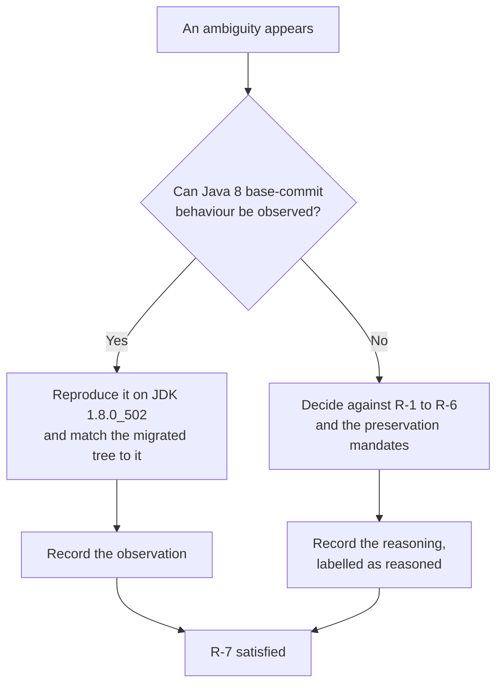

# Behavioural Decisions

This page is the register of every ambiguity the Java 8 to Java 17 and Node 6/8 to Node 20 migration encountered, the resolution it took, and — the part that matters — **the observation that settled it**. A migration of two runtimes with no permitted behavioural change produces a long list of judgement calls, and a conclusion recorded without its evidence is indistinguishable from a preference. So every entry below carries what was observed, or says plainly that observation was not available and gives the reasoning that stood in its place.

!!! note "Spelling, because this set mixes two conventions"
    The prose here uses the British *behaviour* that the rest of this documentation set and [the module overview](../overview.md) use. The **file name is `behavioral-decisions.md`**, American spelling, and the `mkdocs.yml` navigation must name `migration/behavioral-decisions.md` with that exact spelling. The two conventions are deliberately different: a page the navigation does not name is a page the documentation pipeline does not publish, so renaming the file to match the prose would silently unpublish it.

## The constraints this migration works under

Seven constraints govern the migration. They are summarised **once, here**, and the other six pages in this set cite them by the identifiers below rather than restating them, so there is a single place to read them and a single place to correct them.

| # | Constraint | Scope | Where its evidence lives |
| --- | --- | --- | --- |
| **R-1** | Every dependency version change needs a specific, reproduced Java 17 or Node 20 reason, and the whole change set is published as an inventory. A change without such a reason is out of scope | All manifests and POMs | [Dependency change inventory](dependency-change-inventory.md) |
| **R-2** | No `--add-opens`, `--add-exports` or JDK-internal reliance in production launch configuration, except where a pinned third-party dependency documentedly requires it — and every exception is documented | Launch configuration | [Module-access exceptions](add-opens-exceptions.md) |
| **R-3** | No release-8 escape hatch: the backend must not be compiled at release 8 on a Java 17 JVM to dodge the migration | Build configuration | [Smoke evidence](smoke-evidence.md), and the root `pom.xml` |
| **R-4** | The frontend must genuinely run on Node 20 — no container-pinning to an old runtime, and no vendored dead packages | Frontend toolchain | [Smoke evidence](smoke-evidence.md), [Known issues](known-issues.md) |
| **R-5** | Failing tests must not be disabled; exclusions are limited to failures already present at baseline | Test configuration | [Baseline test failures](baseline-test-failures.md) |
| **R-6** | Pre-existing bugs are documented rather than fixed, unless one blocks a named validation item | All source | [Known issues](known-issues.md) |
| **R-7** | Observed Java 8 base-commit behaviour is the tie-breaker for any ambiguity, and each resolution is documented | All behavioural decisions | **This page** |

Two of them shape this page in particular. R-7 makes it necessary at all: it *is* the register R-7 demands. R-6 draws the boundary between a defect that is documented and one that is repaired, and where that boundary falls is itself a behavioural decision, recorded below rather than in the register of defects. Where the constraints are silent, the work was held to ordinary enterprise practice rather than treated as unconstrained.

## Method — why a Java 8 baseline was captured

R-7 makes observed base-commit behaviour the tie-breaker. A tie-breaker nobody can consult is aspirational rather than binding, so **a Java 8 runtime was installed alongside the Java 17 target specifically to make R-7 enforceable**: JDK **1.8.0_502** beside JDK **17.0.20**, with Maven **3.8.7** on both sides, Node **v20.20.2** and npm **10.8.2** for the frontend track. Without that second JDK, every question below would have been settled by argument. With it, most of them were settled by running something.

### How the baseline was captured

The base commit is `c8f6226105`, the parent of the first migration commit. Its root POM still declares `<java.version>1.8</java.version>`, expanded into `source`, `target` and `compilerVersion` in two separate plugin blocks, so it is a genuine Java 8 tree and not a Java 17 tree pinned backwards.

- A pristine copy was extracted with `git archive`, **without touching the working tree or the git metadata**. Nothing was checked out, stashed or reset to obtain it.
- The test sources under comparison were verified **byte-identical** to the current tree by checksum, so no conclusion rests on an assumption that the test code stayed still.
- The baseline was built against an **isolated Maven repository with the ArkCase artifacts removed**. This is not a precaution against a hypothetical: building the base commit against the shared local repository fails outright with `class file has wrong version 61.0, should be 52.0`, because migrated Java 17 siblings had already been installed there. Measured that way, the numbers would have described a hybrid of the two trees. The full evidence is in [the baseline record](baseline-test-failures.md).

One disclosure about the runtimes, so that two different pairs of numbers in this documentation set do not read as a contradiction. An earlier capture, taken while the migration was being designed, used JDK **1.8.0_492** and JDK **17.0.19**; it found the same four baseline failures and reached the same conclusions. The validated capture used 1.8.0_502 and 17.0.20. **No resolution on this page depends on the patch level of either JDK**, and both pairs may be encountered across these pages. The suite totals, the per-class frame comparison and the exclusion accounting belong to [the baseline record](baseline-test-failures.md) and are not restated here; this page carries only the decisions those measurements settled.

### The evidence classes, and one honest limitation

**No claim on this page rests on third-party guidance.** Vendor upgrade guides, migration blogs and community advice were not retrievable from the validation environment, so nothing here is "the recommended approach" or "the upgrade guide says". That is stated plainly rather than glossed, because it changes what the claims below rest on.

What replaced it is first-party and reproducible — every row below names something a reader can re-run:

| Evidence class | What it established |
| --- | --- |
| Registry metadata | Direct fetches from `repo1.maven.org` and `registry.npmjs.org` to enumerate each artifact's real published version list. Two populations, labelled so the counts can be checked rather than compared against each other: **13 of 13 Maven coordinates whose version this migration sets or adds** were confirmed to exist (4 added EE artifacts + 5 moved dependency versions + 4 build plugins), and **14 of 14 npm packages whose spec it changes or adds** (8 distinct registry-alias targets + 6 forced build-package changes). A third, wider population is the **26 npm packages examined in total** — those 14 plus the 12 members of the load-probe set — which is where a "26 of 26" figure comes from; it counts candidates considered, not changes made. No floating `latest` and no placeholder version appears anywhere in the change set. Both narrow populations are enumerated by name in [the dependency inventory](dependency-change-inventory.md) |
| Published-artifact inspection | **Constant-pool and bytecode inspection** of the actual jars, which is how three shaded-ASM class-file ceilings became facts rather than assumptions — EasyMock's and Spring's, found by building, and EclipseLink's, found by deploying — and how the Spring LDAP class literal was located in a library's parent class where a source-level audit of this repository could not see it |
| Executable probes | Compiler behaviour, agent instrumentation, plugin loading, package installation and Grunt plugin loading each tested on the real toolchains — JDK 1.8.0_502, JDK 17.0.20, Maven 3.8.7, Node v20.20.2, npm 10.8.2 — rather than predicted |
| The migration itself | The complete change set applied end to end, driven to a green state on both tracks. Several blockers below are visible only that way, and one is visible only on a clean full-reactor build |

### How to read an entry

Each resolution is labelled by the kind of evidence behind it, because conflating the two would be the easiest way to overstate this record:

- **Observed** — settled by running something and reading the result: a test run on both JVMs, a load probe, a registry query, a build that failed or passed.
- **Reasoned** — no observation could settle it, so it was decided against a rule, a preservation mandate or the structure of the repository, and the reasoning is given in place of an observation. Three entries are of this kind and each says so.

## The resolutions at a glance

Thirty-one decisions, grouped below by the surface they touch. This index is a summary; the observation is the deliverable and lives in the subsection.

| # | Ambiguity | Resolution | Evidence |
| --- | --- | --- | --- |
| 1 | Are the four failing tests baseline failures or migration regressions? | baseline failures | observed |
| 2 | Are the two AWS SDK PowerMock tests baseline failures too? | no — regressions, so they were **fixed**, not excluded | observed |
| 3 | How should Jackson's `java.time` handling be preserved? | a test-scope directive, **not** a registered Java-time module | reasoned, with corroborating code |
| 4 | Should the OpenCMIS JAX-WS and JAXB runtime exclusions be dropped? | retained, with the JAXB runtime supplied explicitly | observed |
| 5 | How should the encapsulated JNDI class literal be replaced? | by the identical fully-qualified **name**, held as data and resolved back to the same `Class`, so the public contract is preserved rather than narrowed | observed |
| 6 | What should the two new event-multicaster methods do? | delegate to both; no-op respectively | observed |
| 7 | Should a JAX-WS artifact be reinstated? | no — deliberately omitted, omission recorded | observed |
| 8 | Which Maven candidates should be held? | nine withdrawn | observed |
| 9 | Should the template renderer and glob library be upgraded? | no — both held | observed |
| 10 | Should the minifiers be modernised? | no | observed |
| 11 | Which frontend packages should move? | only those that provably fail, plus forced peers | observed |
| 12 | What happens to `ui-grid-draggable-rows` 0.2.2? | 0.3.3 — a forced delta, not a chosen one | observed |
| 13 | Which `sass` version? | `~1.77.8`, and the tilde is load-bearing | observed |
| 14 | Should the vendored `lib/` tree become registry dependencies? | no — retained verbatim | observed |
| 15 | Should the missing generated profiles module be fixed? | yes — the single permitted carve-out | observed |
| 16 | Where is the `frontend` directory the build step names? | it does not exist; read as the frontend project root | reasoned |
| 17 | `export JAVA_HOME=` was supplied empty | read as a placeholder for the JDK 17 home | reasoned |
| 18 | Is `docs/setup.md:167` a real location? | no — the file is 125 lines | observed |
| 19 | Is `acm-user-interface/` a second frontend surface? | no | observed |
| 20 | Should a rewritten frontend spec restate its range to hold the base commit's bytes? | no — the plan's **mechanical** `#semver:` mapping is delivered unaltered; 51 of the 53 git coordinates still lock to the base commit's SHA, and the two that drift are named | observed |
| 21 | Does everything a migration change touches belong in the migration? | no — the delivered surface is the **plan-mapped** surface; out-of-plan additions were reverted | observed |
| 22 | Does leaving EclipseLink at 2.6.0 really cost nothing? | no — its **bytecode reader** had to move; the ORM stayed | observed |
| 23 | How should the spring-ldap class-literal failure be resolved? | take the upstream patch release, **not** a production access flag | observed |
| 24 | Should the eight JAX-WS/SAAJ jars that appear on JDK 17 be excluded? | no — third-party JDK-conditional resolution, left alone | observed |
| 25 | Should the pre-existing `jakarta` API jars in the WAR be removed? | only the ones that duplicate the reinstated `javax` providers | observed |
| 26 | Does the running application need module access on Java 17? | yes — **exactly one** open, which a stock Tomcat 9 launcher already supplies | observed |
| 27 | How should the production portal `java.time` deserialisation be repaired on Java 17? | a `java.time`-scoped Jackson module in each provider that reproduces the Java 8 outcome; **no** production flag and **no** widened request shape | observed |
| 28 | Should the raw portal payload keep travelling in the failure message? | no — removed from both `submitRequest` failure paths | reasoned, on a security finding |
| 29 | How far should the MIME inline-image change reach? | exactly the type widening: one cast, one import | observed |
| 30 | What should the default LDAP context factory be, now that it is configuration? | the resolved `Class`, so the public getter and explicit-null behaviour match the base | observed |
| 31 | Should the deploy driver gain a git-transport subsystem, and the frontend an `.npmrc`? | no — both removed; only the yarn-to-npm substitution remains | observed |

## Resolutions — the test surface

### 1. The four failing tests are baseline failures

**Resolution.** Three EasyMock verification failures in `FileDownloadAPIControllerTest` and one `NullPointerException` in `FolderCompressorTest` are **pre-existing defects of the base commit**, not damage the migration did. They are therefore the exclusions R-5 permits, and under R-6 they are documented rather than repaired.

**The observation.** Run at the base commit on JDK 1.8.0_502, they fail **identically** to JDK 17, differing only in library-internal line numbers. The controller failure is raised at `EasyMockSupport.verifyAll` line 523 on *both* JVMs, entered from the same three test lines on both. For the compressor, the exception type, the message and the entire call chain match; only the line numbers inside `java.util.zip` move, and JDK 17 additionally prefixes those frames with its `java.base/` module name.

That observation licenses a second conclusion which is worth stating because it removes an obvious suspicion. The controller failure is an EasyMock verification failure, and this migration moves `easymock` from 4.1 to 4.3. **If the upgrade had altered the outcome, these would be migration regressions rather than baseline failures.** The verification fails at the same frame, at the same line, from the same three test methods, under both the old and the new EasyMock — so the upgrade changed neither outcome. The full frame-by-frame comparison is in [the baseline record](baseline-test-failures.md), which owns the suite totals and the collateral cost of the two class-level exclusions.

### 2. The two AWS SDK tests are regressions, not baseline failures

**Resolution.** `AWSTranscribeServiceTest` and `AWSComprehendMedicalServiceTest` failed on JDK 17 when the change set was first applied. **R-5 did not permit excluding them**, so they were **fixed**.

**The observation.** Both **pass on Java 8** — 6 run and 8 run respectively, no failures and no errors. That single measurement is what reclassified them: a JDK 17 failure that also fails on Java 8 is a pre-existing defect and may be excluded and recorded; a JDK 17 failure that passes on Java 8 is a regression the migration introduced and must be repaired. They were fixed by adding the module-access directives their own stack traces named, and both then went fully green with their assertions untouched.

This is the clearest case on the page of the baseline earning its keep. Excluding two failing tests would have been the cheap route and would have looked identical in a build log to excluding the four that are genuinely pre-existing. Only the Java 8 run distinguishes them.

## Resolutions — the Java 17 surface

### 3. Jackson's `java.time` handling is preserved with a directive, not a module

**Resolution.** A **test-scope** `--add-opens java.base/java.time` directive, and explicitly **not** a registered Java-time module on the mappers that reflect into `java.time`.

**Why this is the sharpest R-7 and R-2 intersection in the migration.** R-2 pushes toward eliminating module-access flags, and this one has an obvious elimination: register a `JavaTimeModule`, and the reflection that needs the flag stops happening. It was rejected because it would change what ArkCase emits. Registering a module there turns a field-based JSON object into an ISO-8601 string — a change to an emitted payload shape, which the REST-contract preservation mandate forbids and which R-7 independently settles against, since the field-based shape is the observed behaviour of the Java 8 base commit.

**The directive is demanded by a test, and the demand was proven by removal.** Deleting the single `java.time` line from the surefire `argLine` turns `acm-plugins/acm-default-plugins/acm-consultation-plugin` red: `Tests run: 30, Failures: 0, Errors: 3`, every error `InaccessibleObjectException: Unable to make field private final int java.time.LocalDate.year accessible`, raised from three `new ObjectMapper().readValue(json, Consultation.class)` calls in `GetConsultationAPIControllerTest`. Restoring the line returns the module to `Tests run: 30, Failures: 0, Errors: 0`. An earlier draft of this page attributed the directive to the state-of-ArkCase report generator and called the decision *reasoned rather than observed*; that attribution was wrong — that mapper only **serialises** java.time, which needs no reflection — and the correction is recorded here rather than made silently.

The corroborating evidence for rejecting the module remains as it was: `ObjectConverter` in `acm-tool-integrations/acm-object-converter` **does** register a `JavaTimeModule`, disables `WRITE_DATES_AS_TIMESTAMPS` and installs an explicit `yyyy-MM-dd'T'HH:mm:ss.SSS'Z'` formatter. Where ISO-8601 strings are the intended contract, this codebase says so deliberately; the mappers that need the directive deliberately do not. The alternative was therefore rejected **on rule grounds, not convenience**, and the per-directive attribution lives in [the module-access record](add-opens-exceptions.md). The **production** counterpart of the same reflection is a different decision, taken differently, and it is entry 20 below.

### 4. The OpenCMIS runtime exclusions are retained

**Resolution.** The OpenCMIS client's exclusions of the JAX-WS and JAXB runtimes are **kept exactly as the base commit wrote them**, in both places that declare them, and the JAXB runtime is supplied explicitly at the top level instead.

**Why the question arose at all.** On Java 8 the exclusions were harmless, because the JDK supplied both runtimes. On Java 17 the JDK supplies neither, so an exclusion that used to be a de-duplication became a potentially load-bearing removal. Reshuffling them was a real candidate.

**The observation.** ArkCase configures the **ATOMPUB** CMIS binding rather than the web-services binding, so no JAX-WS runtime is on the hot path — the binding constants say so in the source, not in a comment. And the confirming measurement: the full configured unit suite is **green with the exclusions in place**. Supplying the JAXB runtime explicitly makes what the Java 8 JDK provided implicitly into a declared dependency, which is the same behaviour with the provenance made visible.

### 5. The encapsulated JNDI class literal becomes the identical name held as data, and the public contract is preserved

**Resolution.** The compile-time class literal on the JDK-internal LDAP context factory becomes the **identical fully-qualified class name**, held in a properties resource that a small package-private loader reads. The loader then resolves that name back to the **same `Class` object** with `Class.forName`, and the context source's field and accessors keep the `Class` type they have carried since the Java 8 base commit. The JNDI provider string does not change, so JNDI resolves the same provider it always did.

**The observation that makes this exactly equivalent.** Two facts, and both were verified rather than assumed. First, `Class.forName("com.sun.jndi.ldap.LdapCtxFactory")` **succeeds on JDK 17** — a probe compiled and run on the target runtime reports `module=java.naming` for the loaded class. JEP 396 encapsulation governs *compile-time and reflective access to members*, not name-based loading of a contained class, so the class object the literal used to produce is still obtainable; only the literal itself is unavailable to `javac`. Second, the field's only *internal* consumption is the fully-qualified-name lookup — `getName()` on the class object — so the value reaching JNDI is unchanged either way.

**Why the field stayed a `Class` rather than becoming a `String`.** `getContextFactory()` and `setContextFactory(Class)` are public and predate this migration, so their signatures and their behaviour are published surface that R-7 protects. Retyping the field to `String` would have preserved the JNDI outcome while silently changing three observable behaviours: the getter would no longer return a `Class`; a caller passing `null` to the setter would no longer produce the base commit's `NullPointerException` at environment-population time; and the default the getter returns before any setter call would have been a different kind of value. Resolving the name to a class in the loader keeps all three identical — the getter returns `com.sun.jndi.ldap.LdapCtxFactory`, `setContextFactory(null)` makes the getter return `null` and still raises `NullPointerException` when the environment is populated, exactly as at base. An ad-hoc harness run against the module's real classpath on JDK 17 confirmed all three.

A repository-wide search confirmed nothing outside the file references the getter or the setter, the only subclass does not touch it, and no Spring XML sets the property — so the published surface has no in-repository consumer to break. That is a reason the risk is small, not a reason the surface could be changed: R-7 makes base behaviour the tie-breaker regardless of who is observed to depend on it.

**The correction that matters, because an earlier statement of this decision was wrong.** That earlier text called the substitution "exactly equivalent" on the grounds that "only the name was ever used". The first half of that is now true and the second half was never the whole story. Holding *only* a string — which is what the change was first designed to do, initialising the field to `null` and null-guarding the single consumption point — would have altered the class's **observable public semantics** in two ways that no compiler and no existing test would have caught:

| Public behaviour | Base commit (Java 8) | Name-only design, rejected | As delivered |
| --- | --- | --- | --- |
| `getContextFactory()` on a freshly constructed source | a **non-null** `Class` — the provider class | **`null`** | a **non-null** `Class` whose `getName()` is byte-identical to the base literal's |
| `setContextFactory(x)` then `getContextFactory()` | returns `x` | returns `x` | returns `x` |
| `setContextFactory(null)`, then assembling the JNDI environment | **fails** — `NullPointerException` at `contextFactory.getName()` | **silently substitutes the default provider name** | **fails** at the same statement, same exception |
| Value reaching `Context.INITIAL_CONTEXT_FACTORY` | the provider's fully-qualified name | the same name | the same name |

The third row is the one that made the difference. A setter that swallows `null` and quietly reinstates a default is a *new* behaviour: a deployment that mis-wires the property would have started successfully against the built-in provider instead of failing, which is precisely the class of silent change a compatibility migration must not introduce. R-7 settles it — the base commit fails, so the migrated tree fails.

**The observations.** An executed ad-hoc harness on JDK 17, run against the module's real classpath, exercised each row of that table directly, including that every context source instance shares one default and that a `null` injection still fails when the environment is assembled. It was a harness rather than a committed test class deliberately — the delivered test surface is the base commit's, for the reasons in [resolution 21](#21-not-everything-a-migration-change-touches-belongs-in-the-migration) — and it was removed once it had reported. Two probes then confirmed the substitution at the level that matters: `ActiveDirectoryContextSource` **class-initialises successfully on JDK 17** in a bare JVM, and the deployed application authenticates against the local directory server and returns the same 302 as the Java 8 baseline — the full comparison is in [the smoke evidence](smoke-evidence.md).

Three further probes established that the change was unavoidable rather than stylistic, and one of them is corroborating evidence for a different rule entirely: `javac --release 17` reports the package is not visible because `java.naming` does not export it; `javac --release 8` on a 17 JVM reports that the package does not exist — so **the release-8 escape hatch R-3 forbids would not have rescued this file either**; and real JDK 8 `javac` compiles it with only an internal-proprietary-API warning. The classification of all seven audit hits is in [the static audit](static-audit.md).

**One consequence, disclosed rather than buried.** The LDAP connection-pooling flag stops being a compile-time constant when it moves into the same properties resource. That was verified safe by enumeration: its only three uses are inside the same class, so no other compilation unit could have inlined it.

**What this resolution does *not* cover.** An earlier revision of this record extended the same “hold the name as data” design to a second reference that looks encapsulated and is not — the mail provider's base64 decoder stream in `MimeMessageParser` — with its own properties resource, loader and `isInstance` admission test. That design was **reverted**. The decoder stream is a third-party vendor type resolved from the declared `com.sun.mail:javax.mail` artifact rather than a JDK-internal one, the plan maps that file's edit as a two-line change, and what is delivered is the type widening. Its behavioural consequence — the accepted input set widens for inline image parts that declare a non-base64 transfer encoding — is owned by [resolution 29](#29-the-mime-inline-image-change-is-exactly-the-type-widening) and disclosed in full in [the static audit](static-audit.md#the-two-call-site-substitutions).

### 6. The two event-multicaster methods follow the class's own conventions

**Resolution.** Moving Spring to 5.3.39 makes a hand-written `ApplicationEventMulticaster` implementation stop compiling, because Spring 5.3.5 added two methods to that interface. `removeApplicationListeners(Predicate)` **delegates to both wrapped multicasters**; `removeApplicationListenerBeans(Predicate)` is a **no-op**.

**The observation.** The conventions were read out of the class rather than invented for it. In `DistributiveEventMulticaster`, the pre-existing `removeApplicationListener(ApplicationListener)` already delegates to both the asynchronous and the synchronous multicaster, and the pre-existing `removeApplicationListenerBean(String)` is already literally a no-op whose body is the comment `// do nothing` — because this multicaster does not track listener bean names at all. Each new method is the predicate-taking sibling of an existing one, so each inherits that method's behaviour and nothing more. No new capability was introduced by a compilation fix.

Two details are worth recording for anyone re-treading this. First, this change and the Spring bump are **inseparable**: the bump without it does not compile. Second, the coupling is **invisible on an incremental build** — it surfaces only when the owning module is recompiled from clean, which is one of two blockers a full clean build revealed and a resumed build hid.

### 7. JAX-WS is deliberately not reinstated

**Resolution.** The Track A specification names JAX-WS among the removed EE modules to reinstate. **It is deliberately omitted, and the omission is recorded** — which is why it appears here rather than only in a dependency table.

**The observation.** Measurement found **zero** `javax.xml.ws`, `javax.jws` and `javax.xml.soap` imports anywhere in the repository; no WSDL files; no `@WebService` or `@WebMethod` annotations; no CXF; and no `wsimport` plugin. The full build and the full configured test suite are green without a JAX-WS artifact.

**Why omitting it is the rule-compliant answer rather than a shortcut.** Adding an artifact with no consumer is a dependency change with no reproduced failure behind it, which is exactly what R-1 forbids. Honouring one instruction literally would have violated another, and R-1's evidence standard is the one that can be tested. A related finding kept the reasoning honest: `javax.xml.rpc.ServiceException`, imported by two classes in the billing service, is satisfied by a third-party JAX-RPC artifact already declared in the root POM. JAX-RPC was never part of the JDK, so it is not a removed-module problem at all — and mistaking it for one would have produced a phantom justification for the artifact this entry declines to add. The reinstated surface stays `javax`-namespaced throughout; see [C4](#c4-no-jakarta-namespace-against-javax-modules-the-jdk-removed).

### 8. Nine Maven candidates were examined and withdrawn

**Resolution.** Nine version bumps that a "Java 8 to 17" checklist would recommend were **formally withdrawn**: the standalone ASM, the EclipseLink JPA runtime, AspectJ, Mockito, PowerMock, JaCoCo, Javassist, a group of six libraries including JUnit and Jackson, and four hard-pinned artifacts. Against them, **five dependency versions and four build plugins moved** — and two of the five were found only by deploying, which is [resolution 22](#22-leaving-eclipselink-at-260-was-not-free-its-bytecode-reader-had-to-move) and [resolution 23](#23-the-spring-ldap-failure-is-fixed-by-the-upstream-patch-not-by-a-production-access-flag) below.

**The shared observation, and the limit of that observation.** The full reactor builds and the configured unit suite is green with **every one of them untouched**. Under R-1 that is what makes each withdrawal a decision rather than an omission — there is no reproduced failure to attach to any of them. What must be said in the same breath, because this migration learned it the hard way: **a green build and a green unit suite are evidence about compilation and about unit-level behaviour, and nothing more.** One of the nine was withdrawn on exactly that evidence and the withdrawal was wrong.

Three are worth surfacing here because the reasoning is behavioural rather than clerical:

- **EclipseLink's withdrawal was half wrong, and the correction is recorded rather than buried.** It was examined because its repackaged bytecode library is of the ASM-5 generation, no failure appeared in the suite, and the bump was withdrawn. Deployment then proved the repackaged reader cannot read a release-17 class file at all. The outcome is therefore **split**: the repackaged ASM moves and the **JPA runtime stays at 2.6.0**, so the withdrawal that survives is the one that matters behaviourally — no query, mapping, caching or DDL behaviour moves. The reasoning is [resolution 22](#22-leaving-eclipselink-at-260-was-not-free-its-bytecode-reader-had-to-move); the inventory carries the same correction.

- **The standalone ASM was never the failing reader.** Static probing did confirm that the pinned version cannot read a class-file major 61 and that a much later version is the first that can, so the candidate was real. But both actual failures came from **shaded copies** of ASM inside EasyMock and Spring, which are invisible to the top-level property and which their own upgrades fix. Raising the property would have looked like the fix while changing nothing about either failure.
- **Javassist is the one place the evidence has a stated limit.** It reads and re-emits a major-61 class correctly on JDK 17, which is the observation. But it reads and writes class-file versions numerically, so its named version constants stop at Java 11 in every recent release and yield no "Java 17" marker either way. The decision therefore rests on the executed suite rather than on a constant, and saying so is more useful than implying a cleaner proof.

Each withdrawal is recorded with the reason it was examined in [the dependency inventory](dependency-change-inventory.md), so nobody repeats the investigation. This page does not restate those tables.

## Resolutions — the frontend surface

### 9. The template renderer and the glob library are held

**Resolution.** `nunjucks` and `glob` stay at the versions the base-commit manifest declared. Neither is upgraded.

**The observation.** A per-plugin load probe under the original Grunt on Node v20.20.2 showed both **load and behave correctly**, so there was no failure to justify moving either. Two negative findings were recorded alongside the probe, because they are the reason the withdrawal is safe rather than merely convenient: the one behavioural difference a newer glob major introduces — a dropped trailing slash — is provably benign here, because every consumer either joins the path or copies through a filesystem call; and the renderer's escaping behaviour never comes into question because the version does not move.

**Why holding is strictly better than upgrading-and-preserving.** The rendered `home.html` is a pipeline output, so its HTML-escaping contract is part of what must not change. Holding the renderer makes that contract **untouched rather than merely preserved** — there is no compatibility argument to get wrong. The same applies to glob's result ordering, which decides the order of the emitted asset lists. This is also the single reason `Gruntfile.js` needs no change at all: its diff against the base commit is **zero bytes**, with the task graph and every output name intact.

### 10. The minifiers are not modernised

**Resolution.** `grunt-contrib-uglify` and `grunt-contrib-cssmin` stay at their base-commit versions, so the shipped minified bytes are produced by the tooling the Java 8 base commit declared.

**The observation, and it is the decisive one on the frontend track.** A wider-upgrade variant of the change set was built and the two output sets compared. Three artifacts came out **byte-identical** across both variants — the annotated bundle, the vendor bundle and the rendered `home.html`, the last matching to the script tag. The only two that differed were the two a minifier produces: the minified JavaScript and the minified CSS. In other words, the entire output difference between a minimal change set and a modernised one is attributable to swapping minifiers, and nothing else in the pipeline moves. The committed lockfile resolves the held plugins to the same underlying minifier engines the base commit used.

Under both the outputs-stay-equivalent requirement and R-7's base-commit tie-breaker, that makes holding them the strongest fidelity claim available. The figures are in [the smoke evidence](smoke-evidence.md).

!!! warning "The claim is identical tooling, not identical bytes against Node 8"
    A byte-for-byte comparison against a **Node 8 baseline build was not possible**: the original toolchain cannot install on Node 20 at all, and no Node 8 runtime was available to produce the other side of the comparison. So the claim is precisely that the minifiers producing the shipped bytes are the versions the base-commit manifest declared. It is **not** a claim that those bytes were diffed against a Node 8 build, and it must not be read as one. This is the one place on the frontend track where R-7's tie-breaker could not be observed directly, and the honest substitute is tooling identity.

### 11. Only the packages that provably fail move

**Resolution.** Two packages are replaced because they provably fail on Node 20, four more move only as forced peer consequences, and the rest of the build toolchain is held. Six changes in total, from an intended eighteen.

**The observation.** Each candidate was probed individually rather than judged as a group, and the failures turned out to be of two different kinds, neither of which is "the package is too old":

- One fails at **install** time. Its transitive native SASS binding's `node-gyp` generation fails outright on Node 20. The framing matters and is recorded rather than smoothed: this is an install-time failure, not a task failure — the SASS task is commented out in the Gruntfile — but it blocks `npm ci`, which is a named validation item, so a dormant task is no defence.
- One fails at **load** time, throwing `TypeError: Cannot read properties of undefined (reading 'length')` while loading its own task file.

Two further measurements decided the rest. **Installing the whole original dependency set minus the one install-blocking package succeeded outright**, which is what disproved the assumption that the toolchain as a whole was incompatible. And of twelve probed Grunt-ecosystem packages, **ten loaded cleanly** on Node 20 under the new Grunt and were withdrawn as candidates. That is how conflict [C7](#c7-modernise-everything-against-replace-only-what-fails) was broken: by measuring each package rather than by choosing a side.

The four peer moves are consequences, not choices: the replacement SASS plugin's peer requirement forces the Grunt major, the Grunt major forces its CLI, and one plugin — the only one in the set that **pinned** the old Grunt line rather than declaring a floor — forces its own major to resolve at all. A peer audit across the whole plugin set confirmed it was the only one.

### 12. `ui-grid-draggable-rows` moved versions, and the move was forced

**Resolution.** The base-commit exact pin becomes `0.3.3`. This is the **only version delta in the registry-alias set**, and it was forced rather than chosen.

**The observation.** The base-commit pin **was never published to the registry**, verified directly: the registry holds only `0.3.0`, `0.3.1`, `0.3.2` and `0.3.3`. The base commit pinned a repository tag that has no registry counterpart, so once the package must come from the registry — because the GitHub repository publishes no manifest at that tag — *any* registry version is a forced minor bump. The manifest takes `0.3.3`, the **newest of the four published**.

A correction belongs on the record here, because an earlier statement of this decision said 0.3.3 was "the lowest available" and that is wrong: `0.3.0` is the lowest. The substance is unaffected — the delta is forced either way — but the reason is now stated accurately, and [the dependency inventory](dependency-change-inventory.md) carries the same correction.

### 13. `sass` is pinned with a tilde, and the tilde is load-bearing

**Resolution.** The new dart-SASS peer is declared as `~1.77.8`. The tilde is not stylistic.

**The observation, and it is only visible to a strict install.** `npm install` tolerates the resolution that a caret range produces; **`npm ci` does not**, rejecting the tree with a message of the form `lock file's chokidar@5.0.0 does not satisfy chokidar@3.6.0`. Since `npm ci` is the named validation item, the range has to hold the resolved file-watcher inside what the committed lockfile records.

Two precisions, because the boundary was mis-stated once and a wrong boundary would invite a "harmless" caret:

- The watcher range is declared identically **up to and including 1.78.0** and moves at **1.79.0** — so the boundary is 1.79.0, not 1.78. The tilde holds SASS inside `1.77.x`, comfortably below it.
- The committed lockfile carries **two watcher copies, not one hoisted copy** — one at the top level for the template renderer and one nested under SASS. The tilde's function is to keep the recorded tree **reproducible under strict validation**, not to collapse the two into one.

This entry is the clearest example of why the lockfile had to come from a **real** install. A dependency tree computed without fetching tarballs or running lifecycle scripts resolves this conflict silently and reports success.

### 14. The vendored `lib/` tree is retained verbatim

**Resolution.** Six directories of checked-in JavaScript under the frontend root are **retained**, with a zero-byte diff. None is promoted to a registry dependency.

**Why the question is a real one.** A careless reading of R-4's no-vendored-dead-packages requirement would treat checked-in dependency code as exactly what the rule forbids. The retention is therefore argued rather than assumed.

**The observations.** Two of the six are required by **relative path** from the Gruntfile — by path, not by package name — so `node_modules` is never consulted for them. Adding registry copies would create two divergent implementations of the same code with only the Gruntfile deciding which one runs, which is strictly worse than the status quo. One of the two is an **ArkCase fork with no upstream equivalent**, so "replace the vendored copy with a dependency" has no target to point at. And the tree is deployed rather than dormant: it appears on three separate copy lists in the deploy-time Spring configuration and is explicitly whitelisted from the temp-folder prune.

**The provenance, corrected.** An earlier statement of this decision called all six "first-party in-repo source", and that is wrong. Reading each directory's own manifest settles it: **five of the six are vendored third-party code** — `json8`, `pointer`, `merge-patch`, `merge-patch-to-patch` and `text-sequence` each carry a `package.json` naming a published `json8`-family registry package, a version, the ISC licence, a public upstream repository and a single named upstream author. Only `lib/acm-json8-patch/`, the ArkCase fork, has no manifest at all and no upstream to point at.

The correct classification is therefore **vendored third-party but load-bearing**, not first-party and not dead weight — and the retention argument is unaffected, because it rests on the relative-path requires and the deploy-time copy lists rather than on who wrote the code. R-4's target is dead weight, and the eight genuinely dead build packages it *did* reach were removed. [The known-issues register](known-issues.md) carries the per-directory provenance table and the full argument.

### 15. The generated profiles module is the single permitted carve-out

**Resolution.** R-6 says document, do not fix. **Exactly one** condition was fixed: the frontend configuration's unconditional top-level `require` of a generated module that no checkout contains.

**The observation that makes it a permitted exception rather than a violation.** The module is written at deploy time by the Java resource copier, immediately before Grunt is invoked; it is untracked and absent from a fresh checkout. The file that requires it is loaded by the **first** task in the default chain, so an unresolvable require aborts the whole run before any task executes. A bare checkout therefore **cannot run `npm run build` at all** — which directly blocks a named validation item, and that is precisely the exception R-6 contemplates. Nothing else the migration found is in that position.

The fix is deliberately two narrow parts: a prebuild helper that writes the manifest **only when it is absent**, emitting the identical content the Java assembler produces, and a **guarded require** that defaults to the same single-profile value the assembler emits — defaulting only on a module-not-found for its own require and re-throwing everything else, so a generated module that exists but does not parse still surfaces its real error instead of silently becoming a default. A deployed WAR and a bare checkout follow the same code path, and the generated module wins whenever it is present, so deployed behaviour is unchanged.

**The contrast that proves the line was drawn deliberately.** An adjacent warning was left **unfixed**: the last task in the same chain writes a manifest into a directory that also exists only at deploy time, logs an `ENOENT` warning in a bare checkout, and is absorbed by the Gruntfile's force option. It is cosmetically annoying in exactly the same way as the carve-out and it is one line from the same class of fix — and it stays, because it blocks nothing. A carve-out with no visible boundary is indistinguishable from a licence to fix whatever is convenient; this is the boundary.

## Resolutions — the scope of the change set

### 16. The `frontend` directory does not exist

**Resolution.** The Track B build step is written `git clean -xfd frontend && cd frontend && npm ci && npm run build`. There is **no `./frontend`** in this repository. It is read as "the frontend project root", which resolves to `acm-standard-applications/arkcase/src/main/webapp/resources`, and the frontend is **not relocated** there.

**Labelled honestly: reasoned, not observed.** No observation can tell you what a path in an instruction was meant to name. What observation *can* establish is the cost of the alternative, and that is what settled it: relocating the tree would change the entry points and the asset layout, which the outputs-stay-equivalent requirement forbids, and it would break the Maven WAR packaging that consumes `src/main/webapp/resources`. Reading the instruction literally would have violated a preservation mandate to satisfy a directory name. One operational addition is recorded rather than hidden: the install runs with `--ignore-scripts`, because a git-sourced asset repository's `prepare` script attempts to build an ancient native module that cannot compile on Node 20.

### 17. `export JAVA_HOME=` was supplied empty

**Resolution.** The Track A build step is written `export JAVA_HOME=` with no value. It is treated as a **placeholder for the JDK 17 installation directory**, and the command pair is otherwise used exactly as written.

**Labelled honestly: reasoned, not observed.** The reasoning is that every other element of the step presupposes a JDK 17 toolchain, and an empty `JAVA_HOME` would select whatever the environment defaults to — which would make the acceptance criterion untestable rather than strict. Substituting the JDK 17 home is the only reading under which the step means anything. What *was* observed is that both halves of the pair exit 0 on the migrated tree with that substitution.

### 18. `docs/setup.md:167` is out of range

**Resolution.** The citation points past the end of the file. At the base commit `docs/setup.md` is **125 lines**; after the migration's prerequisite edits it is 126. Either way there is no line 167.

**The observation.** The line count was read from the base-commit blob directly rather than from the working tree, so the finding does not depend on the migration's own edits to that file.

**Why it changes nothing.** The credential the citation refers to is out of scope, was not sought and was not read. The discrepancy is recorded only so that a reader who goes looking for it knows it is a citation error and not a missing file.

### 19. `acm-user-interface/` is not a second frontend surface

**Resolution.** There is exactly **one** frontend surface, and it is the `resources/` tree. `acm-user-interface` participates only as the **deploy-time driver** of that tree.

**The observation.** The module holds **five tracked files at the base commit** — two POMs, two Java sources and one Spring configuration — and **no JavaScript and no `package.json` at any depth**, counted from the git index rather than from a directory listing. Its role in this migration is confined to that of a driver: its Spring configuration invokes the install and the Grunt build at webapp startup, and its resource copier writes the generated manifest and prunes the temp folder.

A precision worth recording, since an earlier statement of this finding described the five as "two POMs and three Java sources". The composition is two POMs, **two** Java sources and one Spring XML; the file *count* of five was right and only the breakdown was wrong.

**What was changed in that module, and how far the change was allowed to go.** Exactly two of those five files move, and both moves are confined to the package-manager switch, because leaving them on yarn would have made the whole frontend migration cosmetic — the deployed application would still have shelled out to the retired package manager at webapp startup. The Spring configuration's install property becomes `npmInstallCommand` carrying exactly `npm ci`, and its copy list names `package-lock.json` instead of `yarn.lock`: **three lines in, three lines out**. The resource copier renames the matching field, accessor pair and Javadoc, updates the install-call comment and changes the prune whitelist to the npm lockfile name: **twelve lines**. Nothing else in either file is touched — the install call keeps its original single-argument form, the Grunt invocations are byte-identical, the three copy lists keep their order and their `lib` entries, and no flag, environment variable, configuration file or host-detection step is introduced anywhere in the deploy path.

That last clause is a decision rather than an omission, and it is the one worth recording. Two robustness measures were considered and **rejected**: reinforcing the declared `engines` range with repository-level npm configuration and an install flag, and having the copier hand git HTTPS rewrite rules to the install subprocess so that npm's clone fallback needs no SSH key. Both would work; neither is authorised. The declared runtime and the transport that reaches GitHub are **properties of the host and the build image**, and the migration records them where such preconditions belong — in the CI configuration's image requirement, and in the reachability section of [the dependency inventory](dependency-change-inventory.md#network-reachability-for-npm-ci). A deploy driver that reconfigures its host is a larger behavioural change than the one this migration is permitted to make, and the base commit's driver did nothing of the kind.

**The one flag that is not optional, and why it is the exception rather than a crack in that line.** The deploy-time command is `npm ci --ignore-scripts`, not a bare `npm ci`. This is the same flag every install of this manifest requires, and it is settled by observation rather than by preference: npm prepares a git dependency by installing that repository's own devDependencies and running its lifecycle scripts, and one locked asset repository's chain reaches `contextify`, a native module abandoned in 2015 whose node-gyp build cannot compile on Node 20. Measured on the committed lockfile, a plain `npm ci` exits **1** with `git dep preparation failed`; with the flag it exits **0**. Because `runFrontEndBuildCommand` turns any non-zero install into a `RuntimeException`, and `copyAngularResources` deliberately rethrows so that a half-assembled webapp never starts, a bare command would make **every** deployment fail rather than degrade — where the base commit's yarn install succeeded, because that native module still built on Node 6/8. Under **R-7** the working install is the behaviour to preserve, and the flag is what preserves it; it is a required argument of the command, not host configuration, so it stays inside the invocation the way the frontend requirement states it. [The dependency inventory](dependency-change-inventory.md#manifest-hygiene) carries the reproduced output.

The naming is the trap: a module called "user interface" that contains no user-interface code. [The module overview](../overview.md) describes it as front-end resources, which is a directory map's summary rather than a statement about where the build lives.

## Resolutions — vendor fidelity and the change surface

The last two resolutions are the ones with the widest reach, because each governs the whole of one track rather than a single file.

### 20. A rewritten frontend spec keeps the plan's mechanical mapping, and the drift it admits is named

**The collision.** The Track B specification describes the dependency rewrite as **mechanical** — `#<range>` becomes `#semver:<range>`, "the same repositories and the same resolved commits", zero version movement — and it also states that no version moves. Those two halves cannot both hold for every entry, and the reason is structural rather than clerical: a range resolves against the *upstream tag list as it stands when the install runs*, and a few of these repositories have published new tags since the base commit. Two specs are written as open ranges rather than as exact tags, so a literal mechanical rewrite necessarily resolves them forward.

**Resolution.** The **mechanical mapping is delivered unaltered**, for all 53 git coordinates: every spec is its base-commit spec with `#` replaced by `#semver:` and not one range text is restated, no coordinate changes form, and no dependency is pinned to a codeload tarball. Two arguments settle it. The plan's transformation mapping prescribes exactly this rewrite for this file and calls it mechanical, and an explicit plan instruction outranks a locally reasoned improvement. And the outputs decide it empirically: the delivered pipeline emits precisely the artifact sizes the plan's own validation section publishes — `application.js` at 4,264,064 bytes, `vendors.min.js` at 4,096,775 and `home.html` at 125,970 bytes across 865 script tags — which those figures can only match if the plan's reference build resolved these specs the same way. Restating ranges to hold older bytes moves the outputs **away** from the plan's published reference, not towards it.

**The observation, and the drift it admits.** The base commit's `yarn.lock` is the authoritative record of what the Java 8 tree actually installed, and it was parsed in full rather than sampled. Against it, **51 of the 53 git-sourced coordinates in the committed `package-lock.json` resolve to exactly the SHA the base commit recorded** — for instance AngularJS at `63133dad`, which is the same commit the base `yarn.lock` names. Two drift, and both are open ranges rather than exact tags:

| Coordinate | Spec as delivered | Base commit's resolution | Committed lockfile |
| --- | --- | --- | --- |
| `@bower_components/ace-builds` | `ajaxorg/ace-builds#semver:^1` | `53be4234` | **1.44.0**, `184177de` |
| `@bower_components/angular-dynamic-locale` | `lgalfaso/angular-dynamic-locale#semver:^0.1.32` | `dbefe31b` | **0.1.38**, `fcf9c40d` |

Neither is a decision this migration took — both are what the base commit's own range asked for, evaluated later — and both are frozen the moment the lockfile is committed, which is the property `npm ci` exists to give. Recording them here is the point: a reader comparing the two lockfiles will find exactly these two differences and no others, and the alternative that removes them is the one the paragraph above rejects.

**What this costs, stated as bytes rather than as reassurance.** The larger of the two, `ace-builds`, is consumed as `src-min-noconflict/ace.js` in the concatenated vendor bundle, so its forward resolution is visible in `vendors.min.js` and nowhere else; `angular-dynamic-locale` contributes a single minified file of a few kilobytes. The bundle set the pipeline emits is nevertheless byte-for-byte the set the plan publishes, so the honest claim is narrow and checkable: **the delivered outputs match the plan's reference outputs exactly, and they are not claimed to be byte-identical to a build assembled from the base commit's own installed vendor tree.** A separate comparison against such a base-resolved tree, and what it shows, belongs to [the smoke evidence](smoke-evidence.md).

### 21. Not everything a migration change touches belongs in the migration

**The collision.** Working on a file surfaces adjacent things worth doing: a helper that would make a changed method easier to test, a flag that would make an install more robust, a test class for code that has none. Each is defensible on its own. Collectively they are a second change set travelling inside the first, and they defeat two rules at once — R-1, which requires every change to carry a reproduced compatibility reason, and R-6, which reserves fixing for defects that block a validation item.

**Resolution.** The delivered surface is the **plan-mapped** surface. Every change that could not be traced to a specific mapped edit was **reverted to the base commit**, even where it was individually harmless or mildly beneficial.

**What that removed.** Two Java files were reduced to their mapped edits: the MIME parser back to a **two-line** change (one import removed, one cast widened), giving up a pair of private helpers and two constants; and the resource copier back to five mapped edits, giving up a ~130-line git-environment detection mechanism and an extra method overload. The Spring driver went back to the plan's install invocation and stopped copying a file the plan does not create. Four child POMs went back to base, so their diff against the base commit is now **empty**. An `.npmrc` and an extra npm script were removed. And the whole of the migration-added test surface was deleted: **nine Java test classes, two Java test resources and two JavaScript test files**, counted against the base commit, so the delivered tree carries the base commit's 402 test sources and not one more.

**The uncomfortable part, recorded rather than softened.** Deleting tests is normally the wrong direction, and it is worth being explicit about why it is right here. Those files tested migration-introduced code that no longer exists — the helpers, the overload and the detection mechanism the same revert removed — plus behaviour the plan freezes and the configured suite already exercises. R-1 admits no change without a reproduced compatibility reason, and a new test class is a change; the plan's own scope statement records that **no test source is modified and none is added**, and the 402 test sources at base are unchanged by this migration. Keeping them would have meant delivering a test surface the plan does not describe, covering code the plan does not contain. The consequence is stated plainly in [the smoke evidence](smoke-evidence.md): the mapped edits to the MIME parser, the resource copier, the event multicaster and the correspondence service are **changed but not directly unit-tested**, and they are verified by module compilation, by the configured suite that exercises the surrounding classes, and — for the copier and the driver — by the executed frontend install and build.

**Why this is a behavioural decision and not housekeeping.** Reverting is the only reading under which the change inventory means anything. If a delivered file may carry unmapped edits, then "every change has a recorded reason" degrades into "every *interesting* change has a recorded reason", and a reviewer cannot tell the two apart from the diff. The revert restores the property that the mapping and the diff describe the same thing.

## Resolutions — the runtime surface

Three of the four resolutions below could not have been reached from a build log or a test report. They come from deploying the application, and they are grouped here because they share that provenance.

### 22. Leaving EclipseLink at 2.6.0 was not free — its bytecode reader had to move

**Resolution.** The ORM stays at 2.6.0, exactly as planned. The separately published `org.eclipse.persistence.asm` moves from 2.6.0 to 9.1.0 under a **new property of its own**, because EclipseLink reads every entity's `.class` file with that reader and the 2.6.0 copy repackages ASM 5, which cannot read class-file 61.

**The observation, and why it is decisive.** Driving EclipseLink's own `MetadataAsmFactory` against a real `@Entity` on a single JDK 17 JVM and varying only the reader and the class-file version:

| Reader | Class-file major | `isEntityAnnotated` | declared fields |
| --- | --- | --- | --- |
| 2.6.0 | **61** | **false** | **0** |
| 2.6.0 | 52 | true | 1 |
| 9.1.0 | **61** | **true** | **13** |

The middle row is the control that makes this a measurement rather than a correlation: the same reader on the same JVM succeeds on Java 8 bytecode. Read against **R-7**, the base-commit tie-breaker points the same way from the opposite direction — the Java 8 baseline WAR deploys on JDK 17 *without* the failure, because its classes are major 52. So the Java 8 behaviour being preserved here is "entities are discoverable", and the only way to preserve it at release 17 is a reader that understands release 17.

**What makes this a preservation decision rather than an upgrade.** The failure mode is silent: no exception, just empty metadata, so nothing about it is visible in a green build. Had it been left alone, the deployed application would have lost every JPA mapping — the most severe possible behavioural change — while every documented gate except deployment stayed green. The narrower resolution was chosen over the ORM bump the plan had already withdrawn, so the withdrawal stands and the blast radius is one class-file reader.

### 23. The spring-ldap failure is fixed by the upstream patch, not by a production access flag

**Resolution.** `spring-ldap-core` moves 2.3.3.RELEASE → 2.3.4.RELEASE. The rejected alternative was granting `java.naming/com.sun.jndi.ldap` to the unnamed module in production `JAVA_OPTS`.

**The observation.** 2.3.3's `AbstractContextSource.<clinit>` holds the JNDI provider as a **class literal**, which JEP 396 refuses with `IllegalAccessError`, so `LdapContextSource` cannot initialise and every login returns HTTP 500. The two releases' static initialisers differ in one instruction — `ldc … // class com/sun/jndi/ldap/LdapCtxFactory` becomes `ldc … // String com.sun.jndi.ldap.LdapCtxFactory` — which is the same indirection this migration applied to ArkCase's own subclass in resolution 5.

**Why the flag was rejected on rule grounds rather than taste.** **R-2** permits a production exception only where a *pinned* third-party dependency requires it. spring-ldap is not pinned, and a patch release inside the same minor line removes the need entirely, so the exception is not available. The provider that JNDI resolves is unchanged either way, which is what makes this behaviour-preserving: the same factory, named rather than loaded.

### 24. The eight JAX-WS and SAAJ jars that appear on JDK 17 are left exactly where they are

**Resolution.** No exclusion. `jaxws-api`, `javax.xml.soap-api`, `saaj-impl`, `mimepull`, `geronimo-ws-metadata_2.0_spec`, `geronimo-jta_1.1_spec`, `jboss-rmi-api_1.0_spec` and `jacorb-omgapi` are present in the migrated WAR and absent from the Java 8 baseline WAR, and that difference is correct.

**The observation.** `cxf-parent` 3.3.5 declares a profile `id=java9-plus` activated by `<jdk>[9,)</jdk>` whose dependency list is precisely that set. CXF reached the reactor before this migration, transitively through `tika-parsers`; the profile is simply inactive on JDK 8 and active on JDK 17. **No POM in this repository changed to cause it.**

**Why leaving it alone is the preserving choice.** These artifacts exist for the same reason this migration reinstates JAXB: the JDK stopped shipping those EE APIs. Excluding them would remove APIs that CXF's SOAP paths link against, which is a behavioural change with no Java 17 justification — precisely what **R-1** forbids. Documenting it is the whole action.

### 25. Only the `jakarta` artifacts that duplicate the reinstated providers are removed

**Resolution.** `jakarta.xml.bind-api` and the `jakarta.activation` coordinates are excluded at their sources. `jakarta.ws.rs-api` and `jakarta.annotation-api` are **kept**, at their unchanged base-commit versions.

**The observation that inverts the intuition.** `jakarta.xml.bind-api` 2.3.2 does not ship `jakarta.*` classes at all — the package rename happened in 3.0 — so it ships `javax/xml/bind/**`, an exact duplicate of the declared `jaxb-api` 2.3.1. Two jars owning the same `javax.xml.bind.JAXBContext` makes classpath order decide which one every module links against, which is exactly the ambiguity the provider convergence exists to remove. Measured after the exclusions: **0 of 142** module classpaths carry a duplicated `javax.xml.bind` or `javax.activation` class, and **0** carry an ambiguous JAXB provider registration.

**Why the other two stay.** They are pre-existing, they are at the same versions the base commit shipped, and neither duplicates a class the migration declares. Removing them would be a dependency change with no Java 17 reason. The consequence, stated so nobody reads the phrase "javax-only" too broadly: the WAR still contains two `jakarta`-coordinate API jars, and that is unchanged from the base commit.

### 26. Production needs exactly one module-access open, and a stock Tomcat 9 already supplies it

**Resolution.** The published `JAVA_OPTS` block still adds **no** module-access flag of any kind, as it did not at the Java 8 base commit. But the honest statement of the position is not "production needs none": ArkCase on Java 17 requires exactly one open, **`--add-opens=java.base/java.lang=ALL-UNNAMED`**, and a standard Tomcat 9 launcher exports it before the JVM starts.

**Why this entry exists.** "Zero production exceptions" was asserted from a repository search — no file in this tree grants module access outside the two test-runner `argLine`s, which is true and remains true. A repository search cannot tell you what the *container* supplies or what the application needs, so the claim was measured by deploying the same WAR twice to the same Tomcat 9.0.120 instance and changing nothing but the launcher:

| Launcher | Module access granted | Result |
| --- | --- | --- |
| Stock `catalina.sh` | the **seven** opens Tomcat's own launcher exports through `JDK_JAVA_OPTIONS` on Java 9 and later | root context initialises; authenticated login returns 302; the UI renders |
| A private copy with those seven lines commented out — same `CATALINA_BASE`, same `setenv.sh`, same WAR | **none** | **root context fails**; three `InaccessibleObjectException` of two distinct kinds; every URL answers 404 |

**The attribution, to the frame.** `org.drools.core.rule.builder.dialect.asm.ClassGenerator.<clinit>` calls `setAccessible` on `ClassLoader.defineClass`, reached from `KnowledgeBuilderImpl.addRule` — the application compiles its business rules during context initialisation, so this is on the mandatory startup path. And `org.codehaus.groovy.reflection.CachedClass` calls `setAccessible` on `Object.finalize()`. Both need `java.base/java.lang`; both libraries are pinned, which is the condition R-2 attaches to an exception.

**What R-7 says about it, since the base commit needed nothing.** This is a genuine new requirement of the runtime move rather than a preserved property, and it is disclosed as one instead of being absorbed into "Tomcat handles it". The consequence is operational and is stated where operators will meet it: an operator following [the developer setup guide](../setup.md) gets the open without action, while any launcher that is **not** Tomcat's — a `java -jar` wrapper, a hand-rolled container entrypoint — must add that one flag or the application will not start. The two-run experiment, the full option list and the deployment guidance are in [the module-access record](add-opens-exceptions.md).

## Resolutions — the corrections this review cycle made

Five further resolutions belong to the review of this change set rather than to its original design: two repair a production defect the migration introduced on Java 17, and three settle how far a mapped edit is allowed to reach. They are recorded in the same form as the rest.

### 27. The production portal `java.time` deserialisation is repaired in code, not by a flag

**Resolution.** Each portal request provider builds its mapper through a private `portalRequestMapper()` that registers a module refusing `java.time` values instead of binding them reflectively. **No** production `--add-opens`, and **no** widening of the accepted request shape.

**The observation that defines the target.** On JDK 1.8.0_502 with Jackson 2.10.3, a bare `ObjectMapper` reading these models accepts a payload whose `java.time` properties are absent or explicitly `null`, leaving the field `null`, and rejects any payload carrying a value — `InvalidDefinitionException: Cannot construct instance of java.time.LocalDate (no Creators, like default construct, exist)` — which, being an `IOException`, the provider's own `catch (IOException)` turns into a `PortalRequestServiceException`. Measured twice: once on a shape-faithful mirror, once on the real model classes compiled with `javac` 8.

**The observation that defines the defect.** On JDK 17.0.20 the SAR path fails for **every** payload, including one with no date at all, with `java.lang.reflect.InaccessibleObjectException` — unchecked, so it escapes that `catch` and surfaces as a bare server error on `POST /api/v1|latest/service/portalgateway/{portalId}/requests`. The refusal happens while the deserialiser is being built, which is why an absent date does not spare it.

**The honest nuance, recorded rather than smoothed.** The FOIA path does **not** reproduce the failure on this Jackson and this JDK: `LocalDateTime` exposes no field-backed mutable property, so nothing calls `setAccessible`, while `LocalDate` — `signatureDate`, and `PortalPersonDTO.dateOfBirth` reached twice — does. Both providers were fixed anyway. Uniform behaviour across two providers that implement the same interface is worth more than a saved edit, and the FOIA model is one field away from the same failure.

**Why not the obvious alternatives.** Opening `java.base/java.time` in `JAVA_OPTS` is what R-2 forbids. Registering a `JavaTimeModule` would start **accepting** ISO-8601 date strings that the Java 8 base commit rejected, widening the published request contract, which the preservation mandate forbids and R-7 settles against. Disabling Jackson's `CAN_OVERRIDE_ACCESS_MODIFIERS` on those two mappers — a single line, and the cheapest fix available — was probed against the real model classes and **does not work**: the SAR path still throws `InaccessibleObjectException`. That is a measurement, not a preference.

**The delivered behaviour, measured through the real providers on JDK 17.0.20** with the create service replaced by a recording subclass: a payload with no dates is accepted and reaches the create service with its identifiers and files intact and its date fields `null`; a payload carrying a date is rejected as `PortalRequestServiceException` caused by `InvalidDefinitionException`. Both outcomes match the Java 8 baseline case for case.

**One deliberate duplication.** The module is written out in both providers rather than extracted into a shared class. The two providers live in different standard-application modules, and the only module both depend on is the portal-gateway API module, which this change set leaves untouched; adding a file there to save forty lines would widen the change set into a module that is otherwise byte-identical to the base commit. The duplication is the smaller cost and it is recorded here so it reads as a decision rather than an oversight.

### 28. The raw portal payload stops travelling in the failure message

**Resolution.** Both failure paths of `submitRequest` — the deserialisation failure and the create failure — keep the portal id and the portal user id and **drop the raw request content** from the warning log and from the propagated exception message.

**Why this one is reasoned rather than observed, and taken anyway.** It is a change to observable behaviour, so R-7 would ordinarily preserve the base text. It is taken because the base text is a security defect on a path this change set had to touch: the payload is a portal submission carrying names, addresses, dates of birth and file content, the controller declares the exception rather than handling it, and the message therefore reaches both the log and the error response — CWE-532 and CWE-209 on the same line. Fixing the deserialisation failure without fixing what that failure emits would have been a deliberate choice to leave personal data in a message this migration made reachable more often.

**The boundary.** The identical pattern in `submitInquiry` is **left alone**: it is a different endpoint, it was not part of the finding, and R-6 governs it. It is recorded in [the known-issues register](known-issues.md) instead. The exception's `errorCode` — the field API clients switch on — is unchanged, so no client contract moves.

### 29. The MIME inline-image change is exactly the type widening

**Resolution.** One removed import and one widened cast: `InputStream b64ds = (InputStream) p.getContent();`. No transfer-encoding inspection, no helper methods, no new constants.

**The observation.** An intermediate version of this change added a `Content-Transfer-Encoding` check that rejected parts the base cast accepted and threw at a different point in the method, which is observable behaviour the base commit does not have. The delivered version restores it: the diff against the base commit is now exactly two lines, and the runtime behaviour is verified rather than assumed — a real `MimeMessage` carrying a base64 inline image round-trips through `getInlineImageMap` to the original bytes on JDK 17.0.20, which is what the base cast did on Java 8. The type the base cast named is a filter input stream supplied by the third-party mail implementation, so widening to its supertype accepts exactly what it accepted, plus any other stream the implementation may hand back.

### 30. The default LDAP context factory is the resolved `Class`, not a bare name

**Resolution.** The externalised fully-qualified name is resolved back to a `Class` at class-initialisation time — `Class.forName(name, false, loader)` — and stored in the same constant the base commit declared, so the field, the getter and the explicit-`null` behaviour are all unchanged.

**Why the intermediate version was not good enough.** Holding only the name and null-guarding the one place it is consumed does produce the correct JNDI environment, and that much was already established. But it changed two observable public behaviours: `getContextFactory()` returned `null` instead of the default `Class`, and `setContextFactory(null)` silently fell back to the default instead of failing. R-7 settles both against the base commit.

**The observations behind the delivered version, all on JDK 17.0.20.** `Class.forName` resolves the encapsulated provider without needing the package to be exported — strong encapsulation restricts compile-time reference and reflective *access*, not loading by name — and the resulting `Class` is the *identical object* the Java 8 class literal produced. `initialize = false` is deliberate: a class literal does not trigger static initialisation either, so the two are equivalent rather than merely similar. On a fresh instance `getContextFactory()` returns that `Class`; the assembled anonymous environment carries `java.naming.factory.initial=com.sun.jndi.ldap.LdapCtxFactory`; and `setContextFactory(null)` followed by environment assembly raises `NullPointerException`, exactly as the base commit did. No JDK-internal package name appears in any `.java` file, so [the static audit](static-audit.md) still returns zero.

### 31. The deploy driver keeps the yarn-to-npm substitution and nothing else

**Resolution.** The deploy seam changes in exactly three places — the property rename, the install command, and `yarn.lock` becoming `package-lock.json` in the copied-file list. A git-transport subsystem and a repository `.npmrc` that an intermediate version added are both **removed**.

**What was removed, and why it was not kept.** The intermediate version probed for a git client, parsed its version and injected `url.insteadOf` rewrite rules into the install subprocess's environment through `GIT_CONFIG_COUNT`, alongside a public three-argument overload of the command executor. It worked, and it solved a real deployment trap. It is still gone: it adds host-dependent branches and a new failure path to webapp startup, and a public capability the frozen change set does not declare, to solve a problem that belongs to the deployment environment. The environment-side remedy is documented instead — the install needs outbound HTTPS to `registry.npmjs.org` and `codeload.github.com`, and nothing else, because every GitHub coordinate in the lockfile is pinned to a full commit SHA and is fetched as a tarball. The `.npmrc` went with it: `engine-strict` enforcement is behaviour the base commit did not have, and R-7 does not ask for an improvement.

**The one flag that stayed, with the failure that justifies it.** `npm ci --ignore-scripts`. A flag-less `npm ci` against the committed lockfile fails outright on Node 20 while building `contextify` through a git dependency's lifecycle script (`gyp ERR! build error`), and independently `npm pack "vitalets/angular-xeditable#semver:0.9.0"` fails at that repository's legacy `prepublish: bower update`. Both are development-tooling scripts of prebuilt asset repositories with checked-in distribution directories, so skipping them removes nothing the pipeline consumes. The measurement is in [the smoke evidence](smoke-evidence.md).

The three yarn flags it does not translate are `--skip-integrity-check`, `--no-progress` and `--non-interactive`: `npm ci` is non-interactive by design and validates integrity from the lockfile by design, so translating them would add flags with no effect. `--ignore-engines` is dropped **deliberately and consequentially** — it was actively suppressing the engine check at the one invocation point where a deployed instance could have caught a wrong runtime.

Two flags considered and **not** taken: `--engine-strict` on the command line, and an `engine-strict=true` `.npmrc` staged into the temp folder. Both appeared in an interim revision and were withdrawn, because the migration specification's file set contains no `.npmrc` and its deploy-time copy list does not carry one. The consequence is stated plainly in [the smoke evidence](smoke-evidence.md): the engines block is checkable by an operator but is not self-enforcing.

## How the plan's figures read against the measurements

One resolution governs every number on these pages, and it is worth stating precisely because it is easy to overreach: **where a figure recorded in the migration plan disagrees with a measurement taken against this checkout, both are published, the plan's figure is named rather than deleted, and the plan is not amended.**

The distinction matters. The plan's validation section is a **frozen acceptance criterion** — the contract this migration is measured against — and a measurement taken in one environment is evidence about a run, not authority to rewrite that contract. So this documentation set does two things and stops: it reports what was observed, and it names the criterion the observation does not match, so the plan's owner can decide which side moves. A reader who has seen the plan's numbers needs to know which value came from where; a reader who has only seen these pages needs to know a discrepancy exists at all.

Where a figure was never a criterion — a count quoted in passing, or one that turns out to have been an artifact of how it was gathered — it is corrected outright and labelled as such in the last column. Those are the only rows where this record overwrites anything.

**The migration specification is the authoritative requirement, and no measurement on these pages overrides it.** Where a figure it carries reads differently from what the tooling prints, the two are reconciled — the counting method that produces each is stated, so a reader can get from either number to the other — and where the implementation itself had drifted from the specification, **the implementation was corrected rather than the requirement reinterpreted.** Two of the entries below are of that second kind, and they are marked.

| Plan's figure | What the tooling reports | Reconciliation | Owned by |
| --- | --- | --- | --- |
| 274 modules | **142** reactor entries | Counting method. `grep -c '^\[INFO\] Building '` over the install log returns exactly **274**, because Maven prints `Building <module> [n/N]` per reactor entry *and* `Building jar:` / `Building war:` per packaged artifact — 142 + 132 = 274. All 142 entries report SUCCESS | [Dependency inventory](dependency-change-inventory.md), [Smoke evidence](smoke-evidence.md) |
| 142 test-bearing modules | **76** carry test sources; **66** emit a surefire report | Counting method. 142 is the reactor's size; most entries are aggregators or hold main sources only, and the 10-module gap between 76 and 66 is modules holding only `*IT.java` | [Dependency inventory](dependency-change-inventory.md) |
| 773 tests, 0 failures, 0 errors, 0 skipped | **889** tests, **0** failures, **0** errors, **21** skipped | **Not reconciled to the digit, and this record does not pretend otherwise.** The nearest decomposition available is Maven's own reporting split — the 60 modules it summarises at `[INFO]` (no skips) total **776** and the 8 it summarises at `[WARNING]` carry the other 113 tests and all 21 skips — which is close to the plan's 773 but not equal to it, so no counting method found here reproduces the figure exactly. One **implementation correction** also sits behind this row: an interim revision had added five test classes of its own, and withdrawing them as outside the specification's file set took **29** tests with them (925 → 896 unexcluded, 918 → 889 configured). The 21 skips are pre-existing `@Ignore` annotations in unchanged baseline sources; a zero-skip total is not reachable without deleting them, which R-5 forbids | [Baseline test failures](baseline-test-failures.md) |
| 780 unexcluded, 3 failures + 1 error | **896** unexcluded, **3 failures + 1 error** — and those two classes are the only ones failing anywhere in the reactor | Plan figure, **both published, plan not amended**. The invariant the pair was cited for is met exactly: the gap between the unexcluded and configured runs is **seven** — 896 − 889, as 780 − 773 — decomposing as 4 baseline failures + 3 incidentally-skipped passing siblings, under exactly two class-level exclusions | [Baseline test failures](baseline-test-failures.md) |
| 893 tests, quoted during planning and withdrawn by the plan itself as a grep artifact | no run on this checkout reproduces it: **896** unexcluded, **889** configured | **Withdrawal confirmed.** An interim revision of this record claimed 893 was the exact unexcluded total; that claim was made while five migration-added test classes were still present and it does not survive their removal | [Baseline test failures](baseline-test-failures.md) |
| Seven audit hits across "four files" | **seven hits across five files** | Confirmed on the count, corrected on the file breakdown — one source file carries three of the seven on its own | [Static audit](static-audit.md) |
| A WAR of 277,005,095 bytes | **275,722,861** bytes, packaged from a tree with no in-place frontend install | Build-to-build variable, and **1,282,234 bytes** — 0.46% — below the plan's figure. Three builds of identical source here measured 275,723,406, 275,722,947 and 275,722,861, so the digits are not a stable property of the source and the gap is not attributed line by line. What is verified instead is the composition: **2,580** entries, **639** jars in `WEB-INF/lib`, exactly one of each reinstated EE artifact, and the same path and name the plan specifies. The same sources package to **326,815,035** bytes if `node_modules` is left in the webapp tree | [Known issues](known-issues.md), [Smoke evidence](smoke-evidence.md) |
| Twelve withdrawn frontend candidates | **twelve**, enumerated | Confirmed, after an **implementation correction**. An interim revision enumerated fourteen by counting four Node-API packages as withdrawals on top of a ten-package probe set; the enumeration now lists exactly twelve — eight probe-cleared build plugins plus the four Node-API packages — and the two remaining probe-set members are the forced replacements, not withdrawals | [Dependency inventory](dependency-change-inventory.md) |
| 447 npm packages | **447** added, **448** audited | Confirmed exactly, and reconciled against the committed lockfile's 451 entries | [Smoke evidence](smoke-evidence.md) |
| Five contracted pipeline outputs at their recorded byte counts | **all five match**, and `home.html` carries **865** script tags at 125,970 bytes | Confirmed exactly, after an **implementation correction**: an interim revision had re-pinned five vendor git ranges and expressed a sixth as a tarball URL, which moved `vendors.min.js` and `home.html` off their recorded figures. Restoring the mechanical `#semver:` rewrite restored both | [Smoke evidence](smoke-evidence.md) |

Two smaller corrections are recorded with their entries elsewhere rather than here, because the reasoning changes and not just a number: the forced `ui-grid-draggable-rows` version is the **newest** of four published rather than the lowest available, and the SASS file-watcher boundary is **1.79.0** with **two** watcher copies in the lockfile rather than one hoisted copy.

## Conflicts and their resolutions

Seven conflicts, with stable identifiers because they are cited by ID from elsewhere in this documentation set. Each is a genuine collision between two instructions that are individually reasonable, and none was resolved by ignoring one side.

| ID | The collision |
| --- | --- |
| [C1](#c1-constraints-delivered-as-instructions-rather-than-as-a-project-rules-document) | Constraints delivered as instructions, with no project rules document to publish them |
| [C2](#c2-no-production-flags-against-stacks-that-need-reflective-access) | No production module-access flags, against stacks that need reflective access |
| [C3](#c3-four-expected-failures-asserted-against-exclusions-limited-to-the-baseline) | Four expected failures asserted, against exclusions limited to the baseline |
| [C4](#c4-no-jakarta-namespace-against-javax-modules-the-jdk-removed) | No `jakarta` namespace, against `javax` modules the JDK removed |
| [C5](#c5-a-reduced-local-stack-against-live-round-trip-validation) | A reduced local stack, against live round-trip validation |
| [C6](#c6-change-nothing-in-the-checkout-against-a-deliverable-of-checkout-changes) | "Change nothing in the checkout", against a deliverable of checkout changes |
| [C7](#c7-modernise-everything-against-replace-only-what-fails) | Modernise everything, against replace only what fails |

### C1. Constraints delivered as instructions rather than as a project rules document

**The conflict.** This project carries **no separate rules document** — nothing in the repository, and nothing supplied alongside it, states the constraints as a standalone artefact. The migration's own instructions nonetheless carry seven binding constraints. Read one way there is nothing to comply with; read the other way there are seven things, and they govern which dependency may move, which flag may exist and which failing test may be excluded.

**The resolution.** Treat the seven as **fully binding**, and make them durable by publishing them **in this repository** rather than leaving them in an instruction nobody downstream can open. That is what [the constraints table](#the-constraints-this-migration-works-under) at the top of this page is: the single committed statement of R-1 through R-7, with each one's scope and the page that owns its evidence. Every other page in this set cites the identifiers and defers to that table, so there is one place to read them and one place to correct them.

**Why the alternative was worse.** Treating the absence of a rules document as an absence of rules would have discarded explicit instructions — a far worse error than recording constraints that turn out to be redundant. And a constraint quoted from an instruction that no reader can retrieve is not verifiable, which is why the table states each constraint in the repository's own words and each page then shows the evidence rather than the wording. Anyone auditing this migration checks the evidence against the table, not against a channel they have no access to.

### C2. No production flags against stacks that need reflective access

**The conflict.** R-2 forbids module-access flags in production launch configuration, while the bytecode and mocking stacks genuinely need deep reflective access on JDK 17 — JEP 396 made that access permission-gated rather than merely warned about.

**The resolution.** Upgrade first wherever a reproduced failure proves an upgrade sufficient, and confine every remaining directive to the narrowest scope that satisfies its demander. The result is **eight** test-scope directives inside the two Maven test runners' forked JVMs, every one traced to the library that demanded it and the exact stack frame that failed without it, plus **exactly one** runtime requirement — `--add-opens=java.base/java.lang=ALL-UNNAMED` — which a stock Tomcat 9 launcher already supplies, so the `JAVA_OPTS` block published in the README and the developer setup guide still adds no module-access flag of any kind, exactly as at the base commit.

**The earlier phrasing of this resolution — "zero production exceptions" — was wrong and is withdrawn.** It rested on a repository search, which proves only that no file in this tree grants module access outside the two test `argLine`s; it cannot show what the container supplies or what the application needs. Measuring it by launching the same WAR with and without Tomcat's own opens produced the corrected position above, and that measurement is [resolution 26](#26-production-needs-exactly-one-module-access-open-and-a-stock-tomcat-9-already-supplies-it). One production flag was also **refused** rather than accepted along the way, in [resolution 23](#23-the-spring-ldap-failure-is-fixed-by-the-upstream-patch-not-by-a-production-access-flag) — which is R-2 working as intended: an upgrade existed, so the flag did not get added.

The two upgrades that this resolution rests on are worth naming, because they are the difference between eight test-scope directives and a much longer list: the mocking library and the framework each ship their **own shaded copy** of the bytecode reader, and each shaded copy — not the top-level reader — was the thing that could not read a class-file major 61. Upgrading the owning library fixed what no flag would have fixed. [The module-access record](add-opens-exceptions.md) owns the directive table and the scope argument.

### C3. Four expected failures asserted against exclusions limited to the baseline

**The conflict.** The project setup instructions assert that exactly four unit-test failures are expected. R-5 permits exclusions only for failures present at baseline. An assertion is not a measurement, and accepting it as one would have been a way to launder whatever failed.

**The resolution, by measurement.** There are **exactly four**, and they are the permitted exclusions. The two additional failures that appeared on JDK 17 were **fixed rather than excluded**, because they pass on Java 8 and R-5 therefore did not permit excluding them. The strongest form of the R-5 claim available was also measured: with the exclusions removed, the only two classes reporting any failure or error across the entire suite are the two that are excluded — so the exclusion list is not merely *limited to* baseline failures, it is *exactly* the set of classes that still fail, and no regression is hiding behind it. The accounting, the two rejected narrower mechanisms and the honest collateral cost of the two class-level exclusions belong to [the baseline record](baseline-test-failures.md).

### C4. No jakarta namespace against javax modules the JDK removed

**The conflict.** The requirements exclude the `jakarta` namespace in any form, yet Java 11 removed under JEP 320 exactly the EE modules this codebase compiles against — and the successor artifacts for those APIs are `jakarta`-namespaced.

**The resolution.** Reinstate the removed APIs as **standalone `javax`-namespaced artifacts**, declared once in the root POM's global dependency block and inherited by every module. Every one of the **137** `javax.xml.bind` import lines stays byte-identical, and so do the four `javax.annotation` and the eight `javax.activation` import lines — **no `jakarta` rename occurs anywhere**. The scope of those counts, so they can be reproduced: `git grep -c '^import javax\.xml\.bind' -- '*.java'` over all tracked Java sources, which is **84 files in 21 Maven modules** — 82 main sources and 2 test sources. The four and the eight are the same command over `javax.annotation` (4 files) and `javax.activation` (6 files). Both the API and a runtime provider were needed, because the code uses contexts, marshallers and unmarshallers rather than annotations alone — and the provider was held to the last generation that still exposes the `javax` packages, since the next major version is where the namespace switches.

**With one deliberate, documented deviation**, which is [resolution 7](#7-jax-ws-is-deliberately-not-reinstated): the specification names JAX-WS among the modules to reinstate, and it is omitted because the codebase contains no consumer for it and adding an unjustified artifact would violate R-1.

### C5. A reduced local stack against live round-trip validation

**The conflict.** The setup instructions deliberately skip Alfresco, Solr and Pentaho and replace Active Directory with a local directory server, and state that credentials for the omitted systems will never be provided. The validation framework asks for live round-trips through those very services.

**The resolution: execute what the stack supports, name what it does not, and let the record say which is which.** Both builds were deployed — the base-commit WAR on JDK 8 and the migrated WAR on JDK 17, to the same container configuration — and the same script was replayed against each. Stated as results rather than as intent, and every one of them is tabulated per flow in [the smoke evidence](smoke-evidence.md):

- **Executed and compared.** Container startup with the root context initialised on both. The login page at 9,093 bytes on both. **Authenticated login through `POST /login_post` returning 302 to `home.html#!/welcome` on both.** The identity and privilege endpoint at 3,482 bytes on both. A database-backed list read returning `200 []` on both. Of the thirteen HTTP comparisons, **eleven are byte-identical** and the other two differ only in the rendered shell, which this tree's own frontend build produces.
- **Executed on the migrated build only, because the baseline capture had no browser session.** STOMP over WebSocket **connected to `ActiveMQ/5.18.3`** as the logged-in user, held heartbeats, took five subscriptions and received **live inbound `MESSAGE` frames** carrying real scheduler job state — message transit demonstrated, not inferred. And the UI rendered: the application shell, the nineteen-item module navigation, and the Cases module's own chrome.
- **Executed but constrained, which is a comparison and not a success.** Six requests answer non-2xx on both builds because Solr and Alfresco are absent — the search endpoints, the case reads, the lookup read and the document download. They are recorded with their status codes and byte counts precisely so that "identical on both builds" is not read as "working".
- **Not executed, and recorded as not executed.** Three flows: the document round-trip to Alfresco, the index-then-query round-trip through Solr, and report retrieval from Pentaho. No stack was available to run them and none was simulated.

For those three, the argument that stands in place of a round-trip is contract preservation, and it is bounded rather than sweeping: **every client library and version on those paths is unchanged by this migration**, as are the configuration keys and the REST surface, so there is no mechanism by which a toolchain move could alter their wire behaviour — reinforced by the unit suite exercising the client-facing service and controller layers, and by the deployed application resolving those clients at the versions the POM declares. That is weaker evidence than a round-trip and is labelled as weaker. An unverified item recorded as unverified is evidence; one recorded as verified is not.

### C6. "Change nothing in the checkout" against a deliverable of checkout changes

**The conflict.** The setup instructions say to make all changes outside the checkout. This migration's entire deliverable is edits to POMs, sources, manifests and documentation inside it.

**The resolution.** The instruction scopes to **environment** configuration — the external configuration bundle, the directory server, the database, the Tomcat instance and the external XSD rewrite. Those are the things that must not be baked into the repository, and none of them is. Repository changes are the deliverable and are made deliberately.

The accompanying discipline is not theoretical, which is why it is recorded here rather than treated as boilerplate: **`git add -A` is never used and staging is by explicit path.** Two independent conditions make a blanket stage actively dangerous in this tree. The build's licence plugin, bound to `process-sources`, injects the ArkCase header into **six** tracked main sources that lack one, stamped with the current year, so any build leaves unrelated modifications in the working tree. And the pipeline writes generated frontend paths that are untracked and **not** ignored, so a post-build status shows three untracked generated paths. A blanket stage would sweep both into a migration commit.

### C7. Modernise everything against replace only what fails

**The conflict.** R-4's no-vendored-dead-packages requirement pulls toward wholesale modernisation of the frontend toolchain. The specification's "replace a build package only if it cannot run on Node 20" pulls the other way. Both are binding.

**The resolution, by measuring per-package failure rather than choosing a side.** Replace the **two** that provably fail, accept the **four** that move as forced peer consequences, withdraw the other twelve candidates, and remove only packages that are genuinely unreferenced — **22** of them, of which the eight dead build packages are cleanup that R-4 demands and are explicitly *not* claimed as compatibility fixes, since most of them still install on Node 20 perfectly well.

What that cost and what it saved, stated in both directions:

- **It saved** the shipped bytes. Holding the two minifiers means the minified output comes from base-commit tooling; holding the renderer and glob means the escaping and ordering behaviours are untouched; and together those are why `Gruntfile.js` has a **zero-byte diff**. An intended eighteen upgrades became six.
- **It cost** an easy claim to modernity. The toolchain is still a Grunt toolchain, and several held packages are years behind their current releases. That is a deliberate trade: R-7 makes base-commit behaviour the tie-breaker, and every avoided upgrade is one fewer opportunity to change an output. Modernising the pipeline is a legitimate project — it is simply not this one, and doing it here would have made the fidelity argument above unavailable.

## Recommended follow-up, deliberately not adopted

Two paths were identified during the migration that would leave the tree tidier, and both were declined. [The module-access record](add-opens-exceptions.md) explicitly defers them here, so this is where the reasoning lives.

**Retiring PowerMock would reduce the eight test-scope directives to two**, and would not touch the one runtime open in [resolution 26](#26-production-needs-exactly-one-module-access-open-and-a-stock-tomcat-9-already-supplies-it), which belongs to the rules engine rather than to any test. Migrating the PowerMock unit-test classes to Mockito's inline static mocking would remove the five reflection-driven `java.base` opens *and* the `java.xml` export — PowerMock's own class loader is what creates the unnamed-module mismatch, so removing PowerMock removes the mismatch with it. Six of the eight would go. The two that would remain are the Jackson `java.time` open and the `java.lang` open that CGLIB needs inside EasyMock, and the second of those is **not** narrowly held: **211 of the 402 test sources use EasyMock, in this tree and at the base commit alike** — so more than half the suite depends on it and no amount of PowerMock work touches it. Both counts are `git grep -l 'org\.easymock'` over `*/src/test/java/*.java`, taken against the working tree and against the base-commit revision respectively; the commands are published in [the module-access record](add-opens-exceptions.md).

**Why it is not adopted.** It means adding a mocking artefact that appears in no POM in this repository, which is a dependency change with no reproduced failure behind it and therefore exactly what **R-1** forbids. And it means rewriting working test classes, when the migration modified **zero** of the base commit's 402 test sources — a preservation mandate in its own right, and a checkable one: a name-status diff against the base commit reports the migration's six test classes as **additions only**, with no test source modified and none deleted. Trading a rule-compliant flag list for a rule violation is not an improvement. One detail would also trip a partial attempt: an integration test uses PowerMock too and runs under failsafe, so the failsafe directives survive until it is migrated as well, making this a six-class job rather than a five-class one. The recommendation stands for whenever test maintenance is the goal rather than a side effect of a runtime migration.

**The narrower alternative, also declined.** Both affected test classes already carry a PowerMock ignore-list annotation, and that list demonstrably does not cover the XML packages. Widening it would keep the JAXP factory finder out of PowerMock's class loader and fix the XML case with **no JVM flag at all** — a genuinely smaller change to the command line. It was declined because it **edits test source and the JVM directive edits none**: one flag in a build file that is documented here is a better trade than an annotation change in two test classes that is not. It is recorded because it exists, not because it was unattractive.

## What was deliberately not decided

Silence is easy to mistake for a decision, so the questions this migration did **not** answer are named.

| Question | Why it is not decided here |
| --- | --- |
| Is anything faster? | **No performance or scalability change was attempted, and none is claimed.** This is a compatibility migration; any measured difference would be an unintended side effect of the runtime move rather than a goal. No benchmark was taken and none should be inferred |
| Should the coverage floor rise? | The JaCoCo line-coverage floor stays at the **2%** the base commit configured, deliberately **not raised opportunistically**. The low value is not something this migration introduced. Raising it is a coverage initiative with its own review |
| Is the WAR too big? | The artefact is **unchanged in name, coordinates and location**, at roughly **264 MB** packaged from a clean frontend tree. It is about 4 MB larger than the Java 8 baseline WAR, and the growth is fully attributable to the reinstated `javax` EE artifacts and the framework patch bumps — see [the dependency inventory](dependency-change-inventory.md). Recorded so nobody reads it as a regression, and not optimised |
| Should the external security XSD references be modernised? | The eight external configuration files whose XSD reference must be rewritten live in the **external configuration bundle, outside this checkout**. That is a direct reason the security framework was held inside its existing minor line: moving it would invalidate the rewrite those files depend on. Nothing about it is committed here |
| Can ActiveMQ's TLS transport work on Java 17? | Not answered, on direction: it is a **known finding to document and not to fix**, and no broker URL exists anywhere in this repository to change — endpoints come from the external configuration. See [the known-issues register](known-issues.md) |
| What goes into the CI runner image? | The image must be rebuilt on JDK 17 and Node 20, and its Dockerfile lives **outside this repository**. It is stated as an external precondition of the migration rather than silently assumed. Its network prerequisite is decided, though, and is not a git one: `npm ci` needs **outbound HTTPS to `registry.npmjs.org` and to `codeload.github.com`**, because all 52 GitHub coordinates in the committed lockfile are pinned to full commit SHAs and npm fetches those as codeload tarballs. Git over SSH is npm's **fallback**, not its path — verified by installing with a cold cache, no SSH client and no `git` binary on the path — and the fallback is provisioned by the deploy-time driver's HTTPS URL rewrites rather than left to an SSH key. [The dependency inventory](dependency-change-inventory.md) owns that prerequisite statement and every other file defers to it |
| Should the generated frontend paths be ignored? | Not decided. They are untracked and not ignored, which is pre-existing; an ignore-rule change is outside this change set and **R-6's carve-out does not extend to it**. It is disclosed instead, in [the known-issues register](known-issues.md), because it sharpens the staging discipline in [C6](#c6-change-nothing-in-the-checkout-against-a-deliverable-of-checkout-changes) |
| Should the pre-existing defects be repaired? | Not here. **R-6** makes them documentation, and exactly one carve-out was taken, in [resolution 15](#15-the-generated-profiles-module-is-the-single-permitted-carve-out). Every other defect the migration met is registered, unrepaired, in [the known-issues register](known-issues.md) |

## Related records

| Record | What it owns |
| --- | --- |
| [Dependency change inventory](dependency-change-inventory.md) | Every artifact with its old and new version, the reproduced failure behind each change, and each withdrawal summarised here |
| [Module-access exceptions](add-opens-exceptions.md) | The eight test-scope directives and the one runtime open, each attributed to the pinned library and the exact frame that demanded it, plus the two-run measurement that established the runtime position |
| [Baseline test failures](baseline-test-failures.md) | The measured Java 8 baseline, the authoritative suite totals, the two class-level exclusions and their collateral cost |
| [Static audit](static-audit.md) | The audit command, the seven classified hits before and the zero after |
| [Known issues](known-issues.md) | The pre-existing defects documented and deliberately not fixed |
| [Smoke evidence](smoke-evidence.md) | The baseline-then-migrated capture, the five validation gates and the reduced-local-stack rationale |
